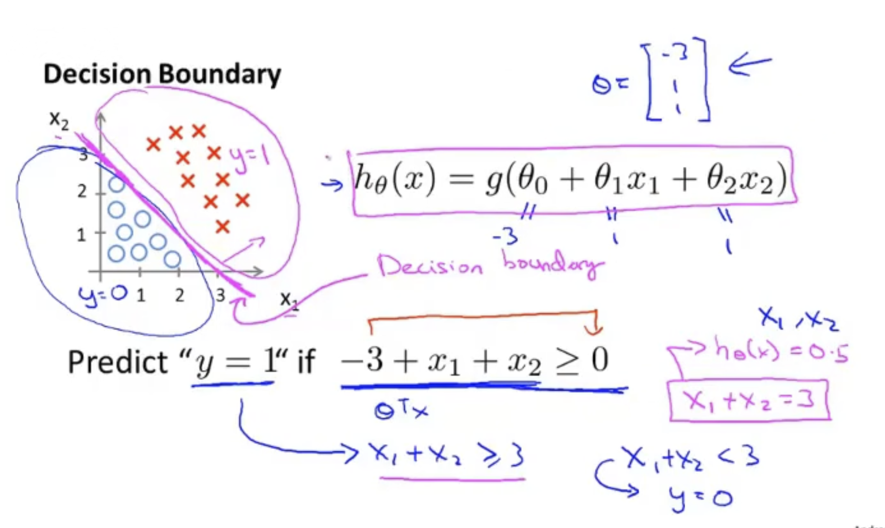
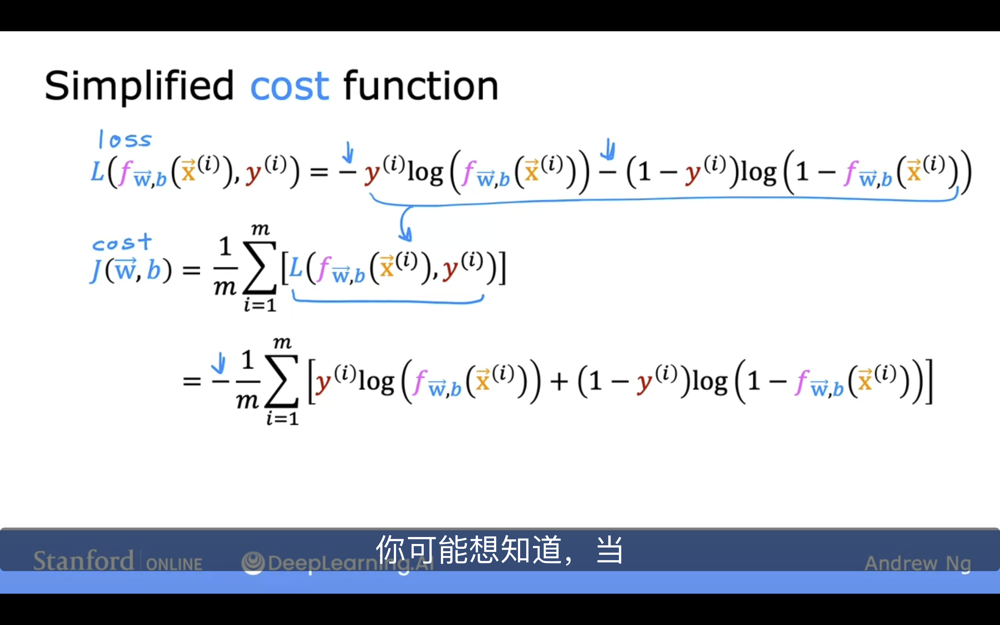

# 逻辑回归

- 如果直接把线性回归应用到分类问题上, 很容易使得模型受到极端值的影响, 从而影响模型的准确度 

- $h_\theta(x) = g(\theta^T X)$, 其中 $X$ 是特征向量，$g$ 是逻辑函数，常用 $g(z) = \frac{1}{1+e^{-z}}$ 

    - 这里 $g$ 关于 $(0,0.5)$ 中心对称
    - $h$ 用来评估在自变量取 $x$ 时，因变量取 1 的概率，即 $P(y=1|x)$

- Decision Boundary 就是使得决策值发生变化的自变量满足的方程绘制的图像

- 代价函数 $cost(h_\theta(x),y) = \begin{cases} -\log(h_\theta(x)) & if\;y=1 \\ -\log(1-h_\theta(x)) & if\;y=0 \end{cases}$

    - $cost(h_\theta(x),y) = -y\log(h_\theta(x))-(1-y)\log(1-h_\theta(x))$

    -  

    - 如果采用线性回归常用的平方误差函数，会导致代价函数非凸，从而使得梯度下降算法可能陷入局部最优解. 而采用逻辑回归的代价函数，可以保证代价函数是凸函数，从而可以保证梯度下降算法可以找到全局最优解
    - 如果采用平方误差函数,或许可以使用一些跳出局部最优解的方法,但是这些方法的效果有待验检 

    - $\theta_j = \theta_j - \alpha \frac{\partial}{\partial \theta_j} J(\theta)$
        - $\theta_j = \theta_j - \alpha \sum\limits_{i=1}^{m} (h_\theta(x^{(i)}) - y^{(i)})x_j^{(i)}$
        - 事实上这和线性回归的梯度下降算法是一样的(形式上 )
