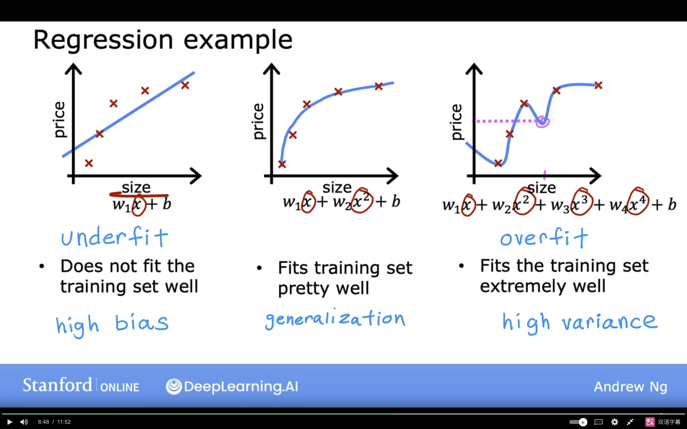
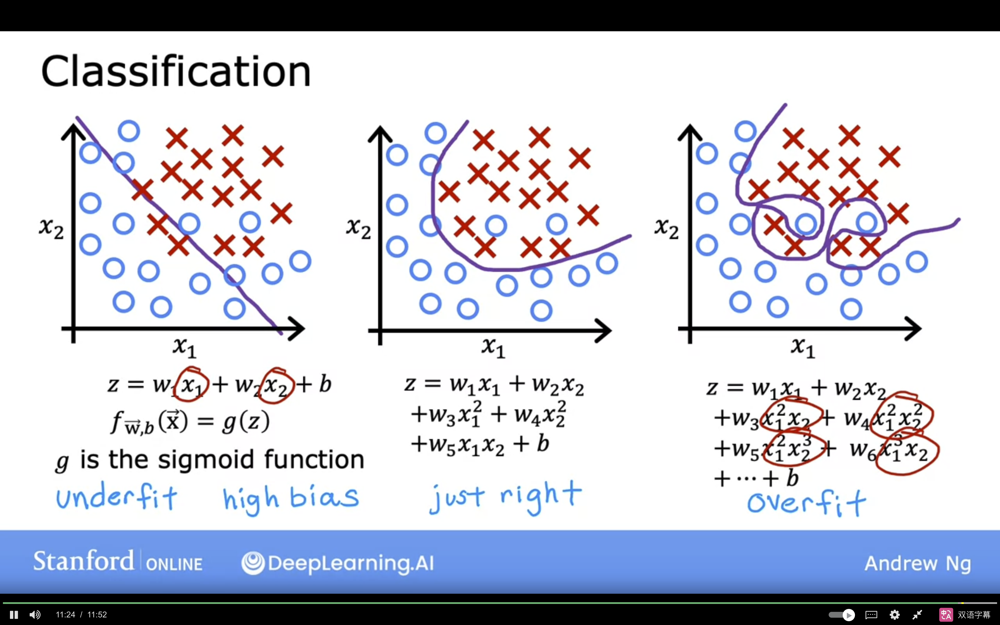
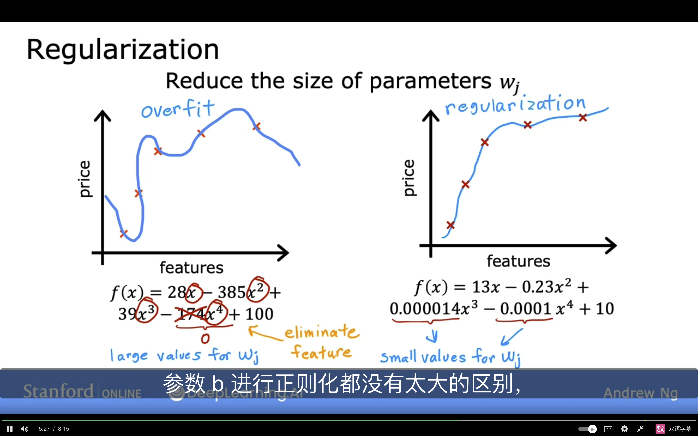
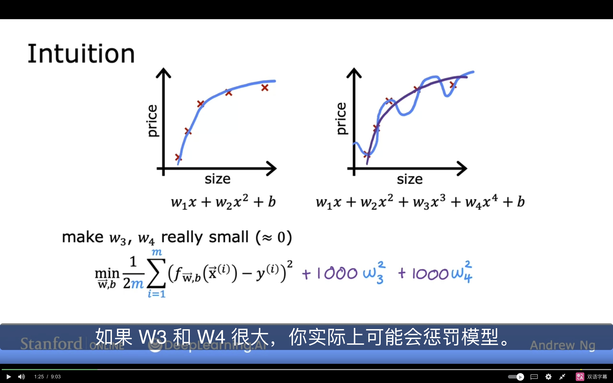
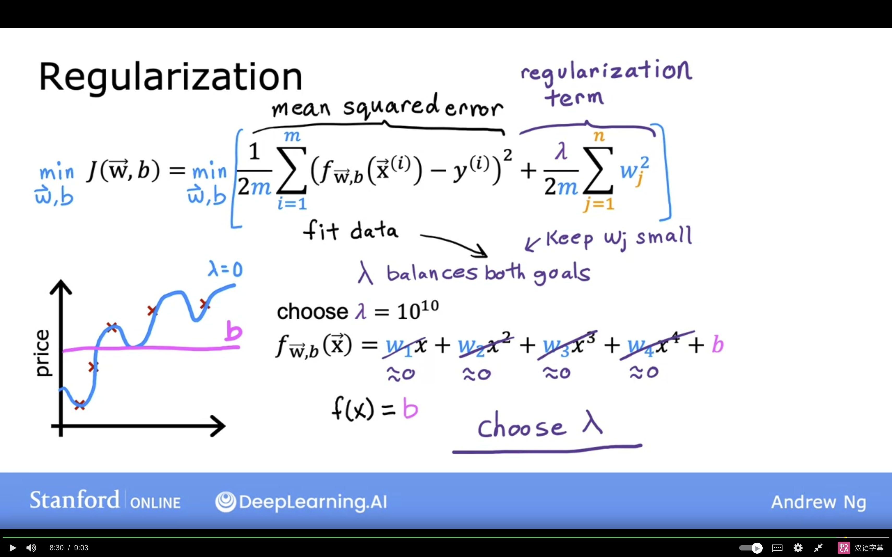
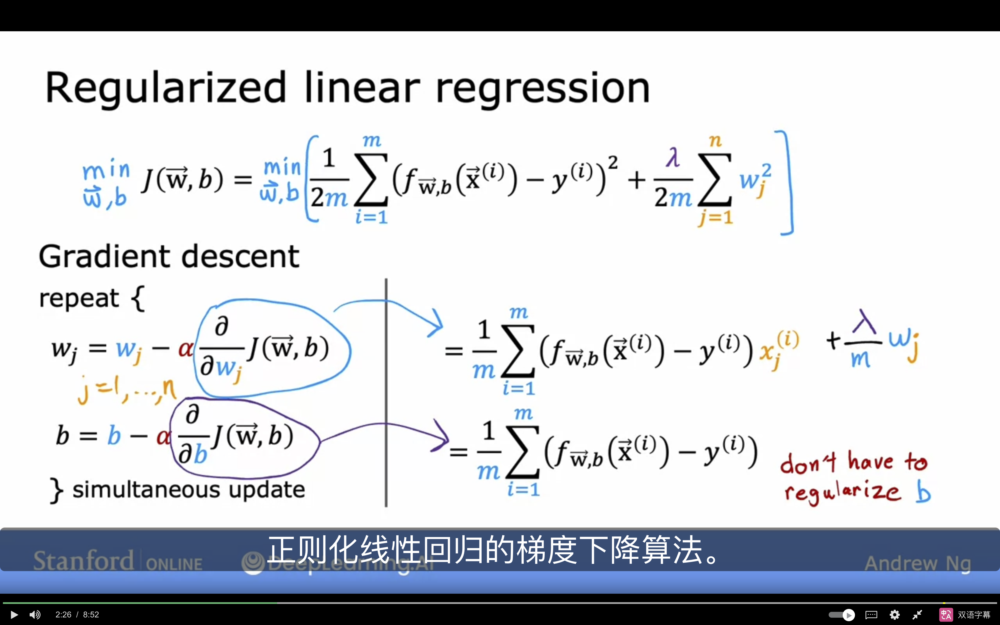

# 过拟合

- 过拟合现象
    - 

    -  

    - 在训练集上表现很好, 但是在测试集上表现很差, 这种现象称为过拟合(Overfitting)

        - 过度追求训练集上的准确度

--- 

- 解决方法
    - 获得更多的训练数据
    - 减少特征的数量
    - 正则化(Regularization)
        - 

---

- 正则化成本函数(coss function)
    
    - 如果对可能导致过拟合的特征的参数添加惩罚项, 可以减少过拟合现象
    -  

    - 但是事实上如果特征非常多, 我们很难判断出到底哪些特征导致了过拟合
        - 于是我们对所有的特征都添加惩罚项

$$J(\omega,b) = \frac{1}{m} \sum\limits_{i=1}^{m} L(\hat{y}^{(i)},y^{(i)}) + \frac{\lambda}{2m} \sum\limits_{j=1}^{n} \omega_j^2$$

-  
    - $\lambda$ 是正则化参数, 控制正则化的程度
    - 如果 $\lambda$ 过大, 那么模型倾向于让每个 $\omega$ 都很小, 从而导致欠拟合
    - 如果 $\lambda$ 过小, 那么相当于没做什么改变, 可能导致过拟合

-  

    - $\omega_j := \omega_j - \alpha \left[ \frac{1}{m}\sum\limits_{{i}=1}^m [(f_{\omega,b}(x^{(i)}) -y^{(i)})x^{(i)} ] +\frac{\lambda}{m}\omega_j\right]$

