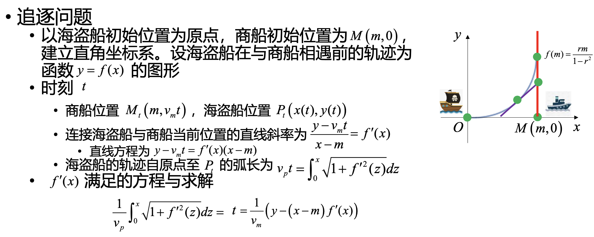
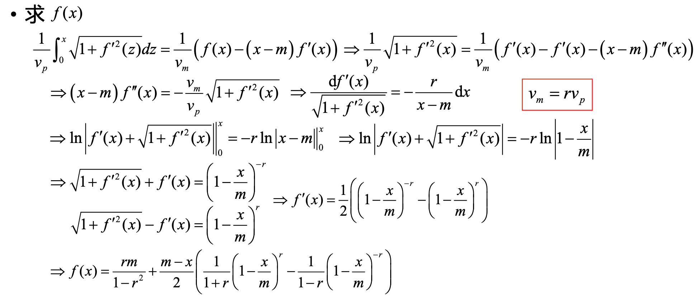
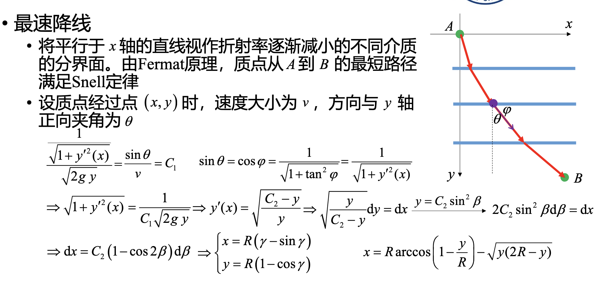
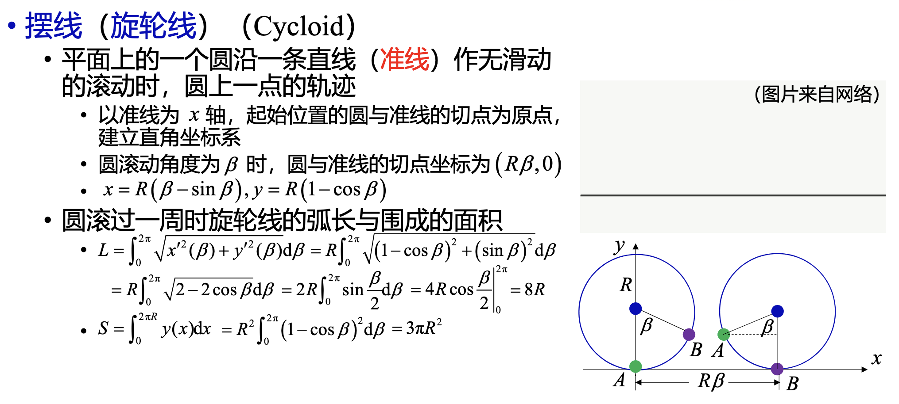

# 常微分方程模型
## 追逐问题
- 一商船（merchant vessel）与一海盗船（pirate ship）从不同地点同时出发。两船可实时观测到对方的位置
  - 两船均沿直线航行,海盗船在确定航行方向前可观测到商船的航行方向
  - 两船在航行过程中速率保持不变,海盗船的速率是商船的$k$倍
  - 商船能否逃脱海盗船的追逐?
    - 制定合理的方向肯定能追上
- 若商船沿直线航行,航向垂直于连接商船与海盗船初始位置的直线。在任意时刻,海盗船的航行方向为连接商船与海盗船此时位置的直线的方向,求海盗船的航行轨迹
  - 
  - 

## 最速降线问题
- 给定垂直平面上两点 ，一质点以何路径从$A$运动到$B$，可使运动时间最短
  - 

- 
- 最速降线
  - $\begin{aligned} & v(t)=\frac{\sqrt{(\mathrm{d} x)^2+(\mathrm{d} y)^2}}{\mathrm{~d} t}=\frac{\mathrm{d} x \sqrt{1+y^{\prime 2}(x)}}{\mathrm{d} t} \\ & \Rightarrow \mathrm{d} t=\frac{\sqrt{(\mathrm{d} x)^2+(\mathrm{d} y)^2}}{v(t)}=\frac{\sqrt{1+y^{\prime 2}(x)}}{\sqrt{2 g y}} \mathrm{~d} x \\ & \Rightarrow T=\int_0^{x_\beta} \sqrt{\frac{1+y^{\prime 2}(x)}{2 g y}} \mathrm{~d} x\end{aligned}$
