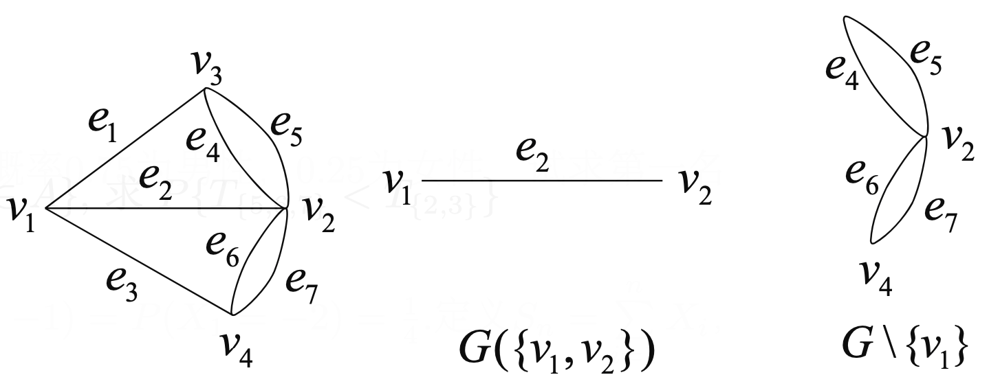
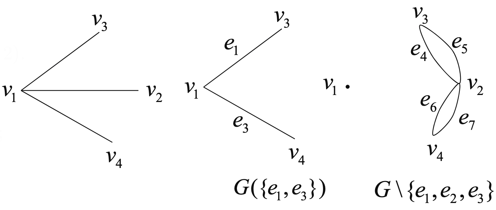
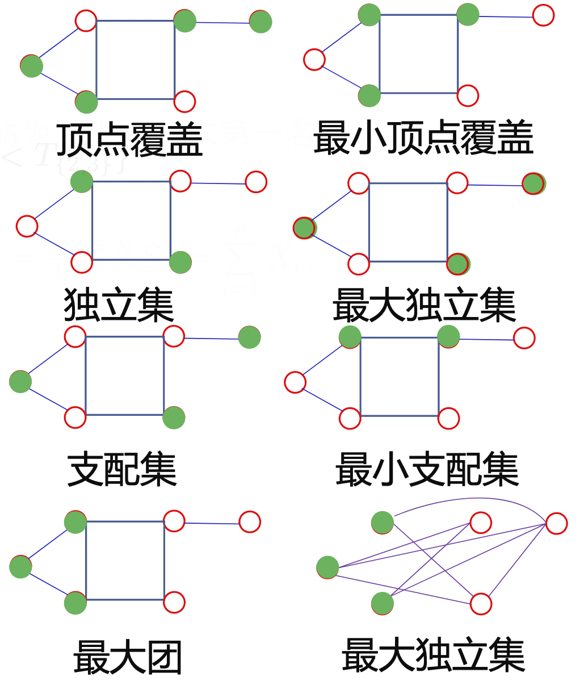

# 图论

- 有序二元组 $G=(V, E)$

    - $V$ 是顶点集合
    - $E$ 是边的集合
    - $E$ 中每条边和 $V$ 中的两个顶点相关联

        - 若与边关联的顶点是有序的, 则称为有向图
        - 若是无序的, 则称为无向图

- 度

    - 无向图 $G$ 中顶点 $v$ 的度是与 $v$ 相关联的边的数目, 记为 $\deg_G(v)$ 或者 $d(v)$
    
    - 图的所有顶点的度的最大最小值称为图的最大最小度, 纪委 $\Delta(G)$ 和 $\delta(G)$

    - 握手定理: 无向图中所有顶点的度的和等于边的两倍

        - $\sum\limits_{v\in V}d(v)=2|E|$

- 简单图

    - 两端点相同的边称为环 $\text{(loop)}$，两端点分别相同的多条边称为平行边 $\text{(parallel edges)}$

    - 既没有环，也没有平行边的图称为简单图 $\text{(simple graph)。不是简单图的图称为多重图 $\text{(multigraph)}$

    - 简单图边的上界为 $C_n^2, n=|V|$

        - 边数接近上界的称为稠密图$\text{(dense graph)}$，边数远离 上界的称为稀疏图$\text{(sparse graph)}$

- 完全图

    - 任何两个不同顶点之间都有边相连的简单图称为完全图  $\text{(complete graph)}$

    - n个顶点的完全图记为 $K_n$，其的边数为 $C_n^2$

- 途径

    - 顶点和边交替出现的序列 $\nu_{i_0}\boldsymbol{e}_{i_1}\boldsymbol{\nu}_{i_1}\boldsymbol{e}_{i_2}\cdots\boldsymbol{e}_{i_k}\boldsymbol{\nu}_{i_k}$ 且序列中与 每条边相邻的两个顶点为该边的两个端点，称为连接顶点 $v_{i_0}, v_{i_k}$ 的途径

    - 经过边互不相同的途径称为迹 $\text{(trail)}$

        - 起点和终点相同的迹称为闭迹

    - 经过顶点互不相同的途径称为路 $\text{(path)}$

        - 起点和终点相同，其余顶点互不相同，也不与起点和终点相同的途径称为圈 $\text{(cycle)}$
    - 边赋权图中一条路所含边的权之和称为它的长度

- 二部图

    - 若图的顶点集可以划分为两个非空集合 $X$ 和 $Y$ ，使得图中任一条边的两个端点分属 $X , Y$ 两个集合，则称该图为二部 图 $\text{(bipartite graph)}$，记为 $G =  (X\cup Y, E)$

    - $X$ 中所有顶点与 $Y$ 中所有顶点都有边相连的二部图称为完全二部图

    - $G$ 是二部图当且仅当 $G$ 没有奇圈

- 连通

    - 无向图 $G$ 中，若从顶点 $u$ 到顶点 $v$ 有路相连，则称 $u$ 和 $v$ 是连通的 $\text{(connected)}$

    - 无向图中任意两顶点均连通的图称为连通图 $\text{(connect graph)}$

- 子图

    - 设 $G=(V, E), G'=(V', E')$ 是图，若 $V'\subset V$ 且 $E'\subset E$，则称 $G'$ 是 $G$ 的子图 $\text{(subgraph)}$

        - 生成子图 $\text{(spanning subgraph)}$ 是包含 $G$ 的所有顶点的子图

        - 诱导子图 $\text{(induced subgraph)}$ : $G(V'), G\setminus V', G(E'), G\setminus E'$
            
            -  

- 树

    - 连通的无圈图称为树 $\text{(tree)}$
    - 图G 的为树的生成子图为称生成树 $\text{(spanning tree)}$

        -  

- 最小生成树 $\text{minimum spanning tree，MST}$

    - 赋权图所有生成树中总权和最少的生成树称为最小生成树

- 最短路 $\text{(shortest path)}$

    - 图中两个顶点之间的路中，边的权之和最小的路称为最短路

- $\text{Hamiltonian cycle}$

    - 图中经过每个顶点一次且仅一次的圈称为哈密顿圈

    - 存在哈密顿圈的图称为哈密顿图

- 顶点覆盖

    - $V$ 的一个子集 $V'$，使得 $E$ 中的每条边至少有一个端点在 $V'$ 中，称为 $G$ 的顶点覆盖 $\text{(vertex cover)}$

- 独立集

    - $V$ 的一个子集 $V'$，使得 $V'$ 中的任意两个顶点在 $G$ 中不相邻，称为 $G$ 的独立集 $\text{(independent set)}$

- 支配集

    - $V$ 的一个子集 $V'$，使得 $V'$ 中的每个顶点与 $V\setminus V'$ 中某个顶点关联,称为 $G$ 的支配集 $\text{(dominating set)}$

- 团

    - $V$ 的一个子集 $V'$，使得 $V'$ 中的任意两个顶点在 $G$ 中相邻，称为 $G$ 的团 $\text{(clique)}$

- $V'$ 是 $G$ 的独立集当且仅当 $V\setminus V'$ 是 $G$ 的顶点覆盖

- $V'$ 是 $G$ 的独立集当且仅当 $V'$ 是 $G^c=(V, E^c)$ 的团

-  

- 匹配

    - $E$ 的一个子集 $E'$，称为 $G$ 的匹配 $\text{(matching)}$，若 $G$ 中任意顶点至多与 $E'$ 中的一条边关联

    - 完美匹配 $\text{(perfect matching)}$ : $G$ 中每个顶点都与 $E'$ 中的一条边关联

    - 无权图中边数最多的匹配称为最大基数匹配

    - 赋权图中权最大的匹配称为最大权匹配

    - 若赋权图存在完美匹配，权最小(大)的完美匹配 称为最小(大)权完美匹配

