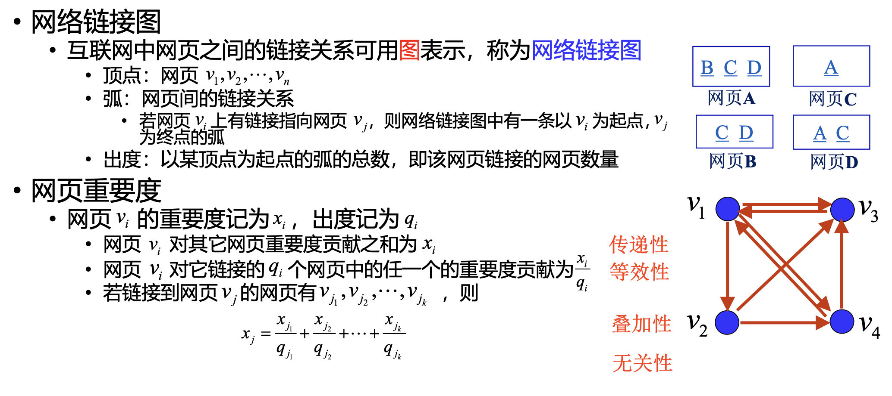
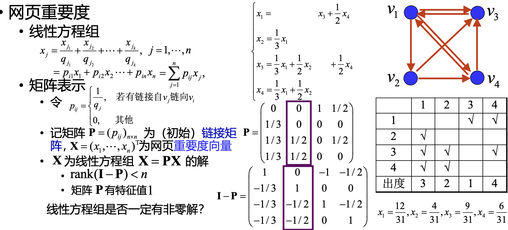
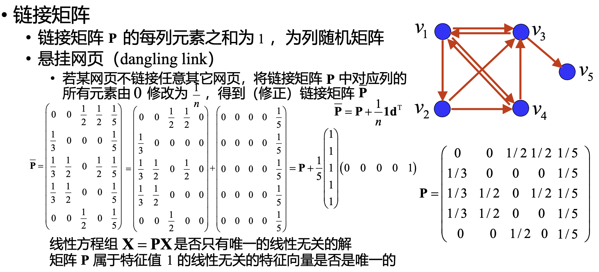
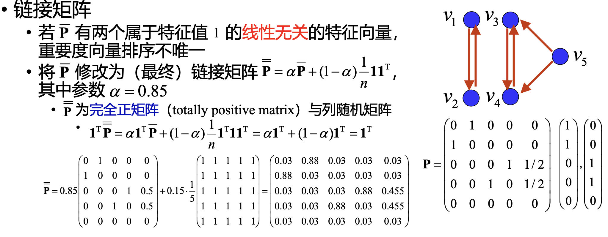

## 互联网中的网页通过超链接连接

# 网页重要度

**一个网页重要,是因为有重要的网页链接到它**

    对每一个网页,定义一个重要度,作为网页排序的规则
    链接到网页的网页对这个网页的重要都都有贡献,贡献的大小和自身的重要度有关
    
    •(传递性)重要度大的网页链接到网页A时对网页A的重要度的贡献比重要度小的网页链接到网页A时对网页A的重要度的贡献大 
        
        •某网页对其它网页重要度的贡献之和等于它的重要度 
    
    •(等效性)网页对它所链接的每个网页的重要度的贡献相等 
        
        • 某网页对其它网页的重要度贡献与它所链接的网页数量呈反比 
    
    •(叠加性)链接到网页A的网页越多，网页A越重要 
        
        • 网页A的重要度是所有链接到A的网页对网页A的重要度的贡献之和 
    
    •(无关性)网页链接其它网页的多少，与其本身的重要度无关

---
实际上这就是一个有向赋权图

---
如何计算呢？
$$
x_j=\frac{x_{j_1}}{q_{j_1}} + \frac{x_{j_2}}{q_{j_2}} + \cdots + \frac{x_{j_k}}{q_{j_k}}=\sum_{i=1}^{n}p_{i,j}x_i\\
X=\begin{bmatrix} x_1 \\ x_2 \\ \vdots \\ x_n \end{bmatrix}\\
\\
p_{i,j}=\begin{cases} \frac{1}{q_j} & \text{如果网页j链接到网页i} \\ 0 & \text{其他} \end{cases}
then:X=PX
$$

---
一定有非零解吗？

注意到$P$的每一列元素之和为1,所以 P 是列随机矩阵

### 随机矩阵

各行（列）元素之和均为1的非负方阵称为行(列)随机矩阵(row(column) stochastic matrix)

各行与各列元素之和均为1的非负方阵称为双随机矩阵(doubly stochastic matrix)

#### 任意随机矩阵的模最大特征值是1

设$\lambda$是矩阵$P$的特征值,非零向量$X$是对应的特征向量,设$|x_s|=\max |x_i|$,则

$$
\lambda X=PX\Rightarrow\lambda x_s = \sum_{i=1}^{n}p_{i,s}x_i\Rightarrow \lambda x_s = \sum_{i=1}^{n}p_{i,s}x_i\\
then:|\lambda|| x_s| = |\sum_{i=1}^{n}p_{i,s}x_i|\leq \sum_{i=1}^{n}|p_{i,s}||x_i|\leq |x_s|\sum_{i=1}^{n}|p_{i,s}|=|x_s|\\
then:|\lambda|\leq 1
$$

# 链接矩阵的修正

    悬挂网页:没有链接出去的网页,也就是不链接任何网页的网页

    网页团,相当于一部分网页互相链接,但是不链接到外部
    比如抖音和快手相互链接,YouTube 和 Facebook 相互链接

# 现在可以求解重要度

**解决唯一性:完全正,列随机矩阵的属于特征值 1 的特征向量是唯一的**

   先证明其特征向量的分量和不为 0

- 设$\mathbf{X}=\left(x_1, \cdots, x_n\right)^{\top}$ 为完全正,列随机矩阵$\mathbf{P}$ 的属于特征值 1 的特征向量，则 $x_i=\sum\limits_{j=1}^n p_{i j} x_j$

    这里是严格小,因为有负数
- 若$\sum\limits_{i=1}^n x_i=0$,则$\mathbf{X}$ 的分量有正有负，故$\left|x_i\right|=\left|\sum\limits_{j=1}^n p_{i j} x_j\right|<\sum_{j=1}^n p_{i j}\left|x_j\right|, i=1, \cdots, n$
- $\sum\limits_{i=1}^n\left|x_i\right|<\sum\limits_{i=1}^n \sum\limits_{j=1}^n p_{i j}\left|x_j\right|=\sum\limits_{j=1}^n\left|x_j\right|\left(\sum\limits_{i=1}^n p_{i j}\right)=\sum\limits_{j=1}^n\left|x_j\right| \quad$ 矛盾

  再证明唯一性,这里如果 v 和 w 是一样的按定义 x 就是零向量

- 设 $\mathbf{v}=\left(v_1, \cdots, v_n\right)^{\mathrm{T}}$ 和 $\mathbf{w}=\left(w_1, \cdots, w_n\right)^{\mathrm{T}}$ 是完全正、列随机矩阵 $\mathbf{P}$ 的两个属于特征值 1 的线性无关的特征向量。令 $x_i=-\frac{W}{V} v_i+w_i, i=1, \cdots, n$ ，其中 $V=\sum\limits_{k=1}^n v_k \neq 0 ， W=\sum_{k=1}^n w_k$
- 由 $\mathbf{v}$ 和 $\mathbf{w}$ 线性无关，与 $\sum\limits_{j=1}^n p_{i j} x_j=\sum\limits_{j=1}^n p_{i j}\left(-\frac{W}{V} v_j+w_j\right)=-\frac{W}{V} \sum\limits_{j=1}^n p_{i j} v_j+\sum_{j=1}^{k=1} p_{i j} w_j=-\frac{W}{V} v_i+w_i=x_i$ ，可知 $\mathbf{x}=\left(x_1, \cdots, x_n\right)$ 为 $\mathbf{P}$ 的属于特征值 1 的特征向量
$\sum\limits_{i=1}^n x_i=\sum_{i=1}^n\left(-\frac{W}{V} v_i+w_i\right)=-\frac{W}{V} \sum\limits_{i=1}^n v_i+\sum\limits_{i=1}^n w_i=0 \quad$ 矛盾

    这样就求出了网页的重要度

[RESOURCES](https://github.com/TyrannosaurusLjx/COURSES/blob/main/Mathematical_modeling/files/02%20Google%E6%90%9C%E7%B4%A2%E5%BC%95%E6%93%8E%E7%9A%84PageRank%E6%A8%A1%E5%9E%8B.pdf)
