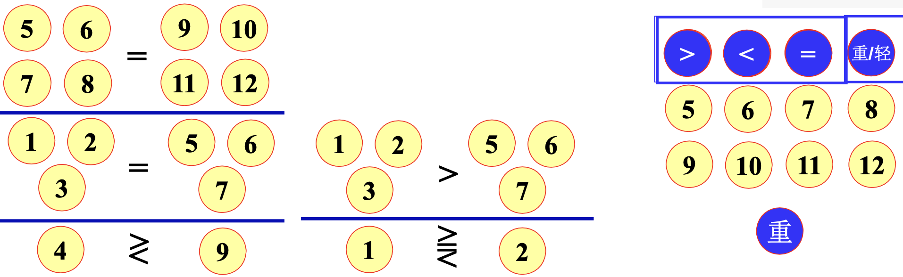
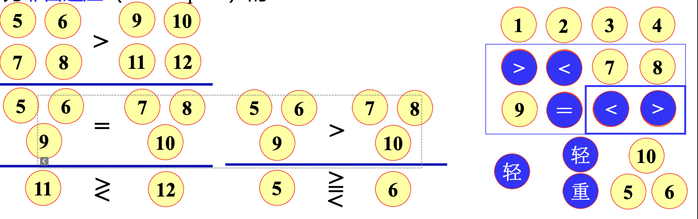
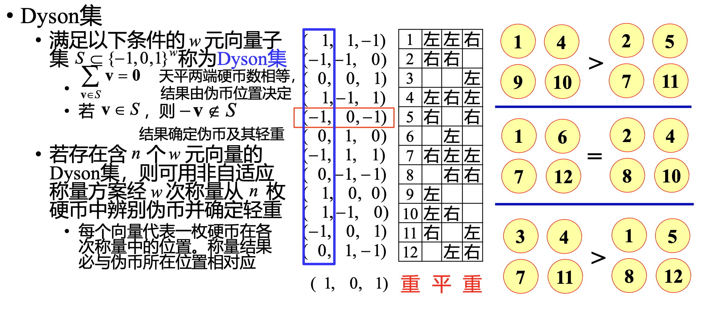

# 伪币辨识

后一次称量依赖于之前的称量结果的方案称为自适应的,否则称为非自适应的

### 12 个硬币中有一个假币,不知轻重,用三次称量找出这个假币

对任意整数$w>2$:若$3\leq n \leq\frac{3^w-3}{2}$,则存在非自适应的称量方案,使用 w 次称量可以从 
n 枚硬币中确定伪币并判定轻重,不然则不存在

通过构造 Dyson 集来确定每个硬币在每次称量中的位置

[RESOURES](https://github.com/TyrannosaurusLjx/COURSES/blob/main/Mathematical_modeling/files/03%20%E6%95%B0%E8%AE%BA%E4%B8%8E%E7%BB%84%E5%90%88%E6%A8%A1%E5%9E%8B(1).pdf)

