# 处理机管理(进程管理)

    当进程被创建,操作系统会为该进程分配一个唯一的标识:PID(Process ID)


操作系统记录的所有信息都存储在一个数据结构PCB(Process control block)中,即进程控制块


# 进程的组成


 

# 进程的特性

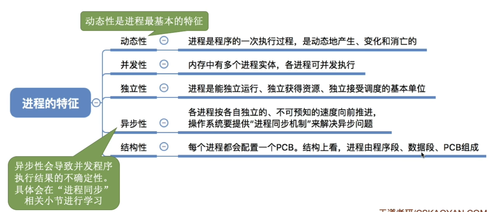

# 总结

 

# 进程的状态和转化

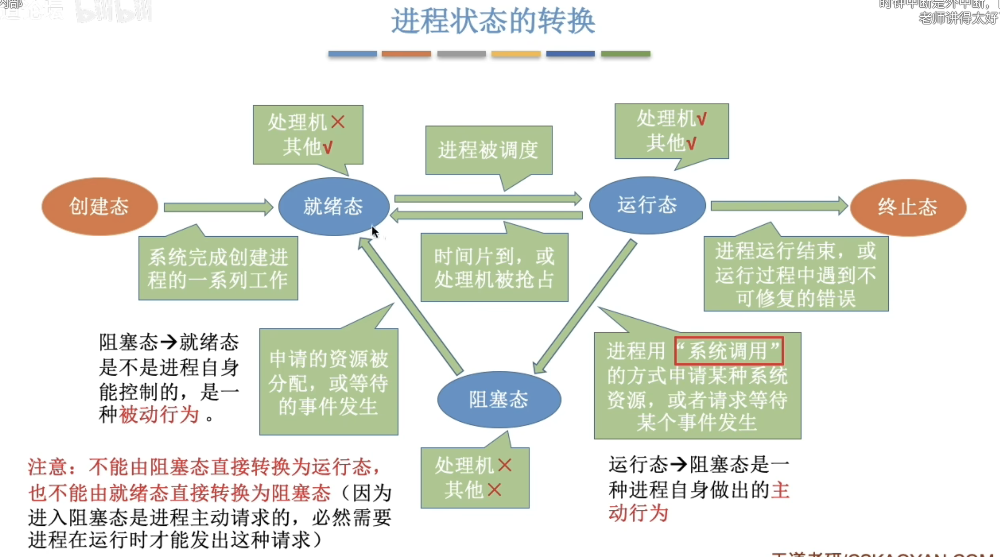

# 总结

 

# 进程控制


 
### 创建原语


### 撤销原语


### 阻塞原语

 

### 切换原语

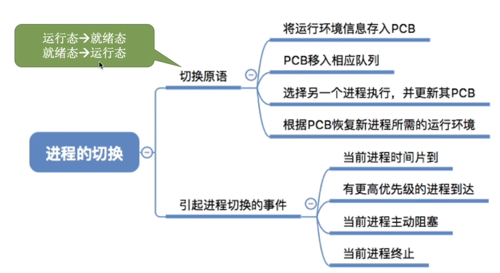

# 总结
 


# 进程通信

# 共享存储

 

# 消息通信

# 管道通信


    管道只能实行半双工通信,如果要实现全双工通信,那么就要向操作系统申请两个管道
    每个进程互斥的访问管道(操作系统实现)
    管道写满的时候,写进程被阻塞
    管道为空的时候,读进程被阻塞
    管道中的数据一旦被读取就会消失,所以多个进程读取的时候可能会出现问题,(标准答案是可以有多个写进程但是只能有一个读进程,但是实际上通过操作系统的调度可以实现多个读进程<linux>)

# 总结
 

# 线程多线程模型

# 线程引入带来的变化


# 线程的属性
 

#  多线程模型


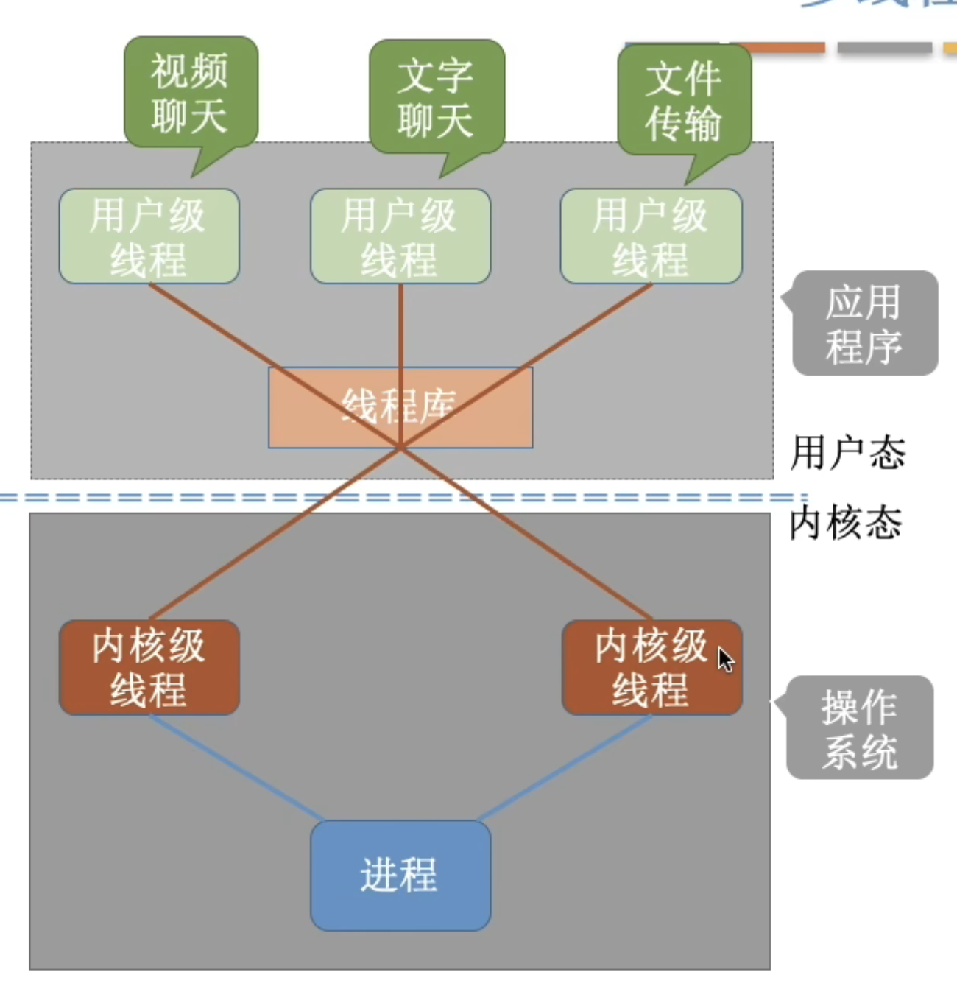

# 总结


# 线程的状态与转换

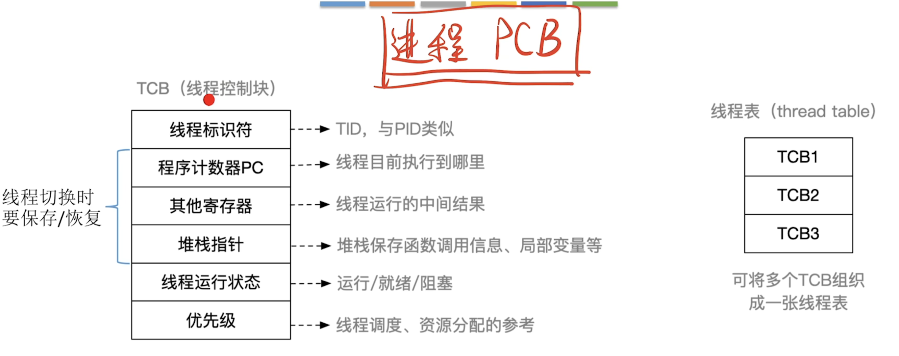


# 处理机调度


当有一堆任务要处理，但由于资源有限，这些事情没法同时处理。这就需要确定某种规则来决定处理 这些任务的顺序，这就是“调度”研究的问题。

# 七状态模型

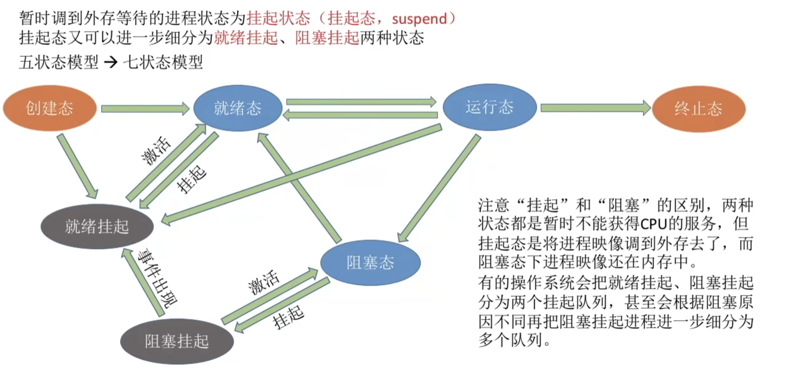


# 调度的联系对比
 

# 总结
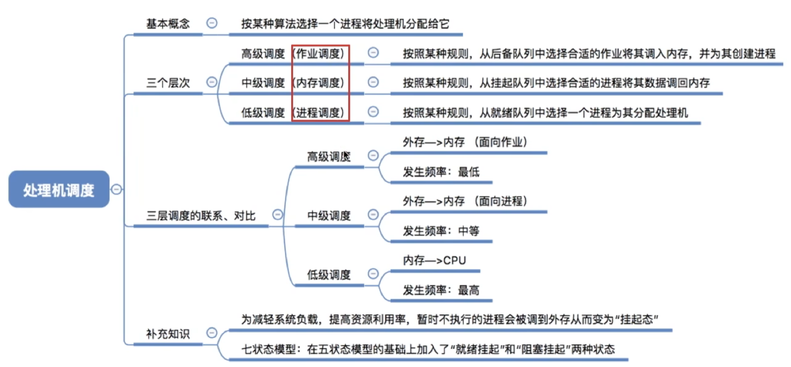 

# 进程调度

# 进程调度的时机


# 进程调度的方式
 
    
实现简单,系统开销小但是无法处理紧急任务,适用于早期的批处理系统


可以优先处理紧急任务,让进程按时间片轮流执行,适合[分时操作系统,实时操作系统](./chapter1.md@L46)

# 进程调度和进程切换


    狭义就是可以不切换进程，可以继续选择刚才的；广义的就是:不行，你必须切换另一个进程

# 总结

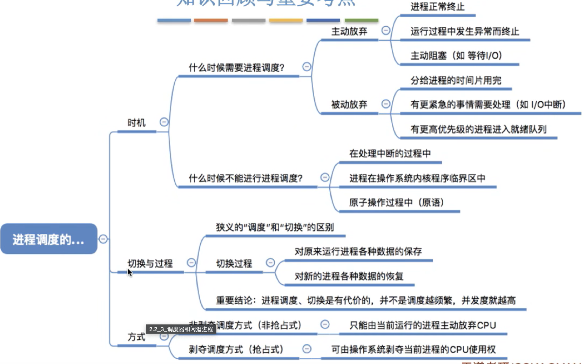

# 闲逛进程
 

# 评价调度算法的指标


    cpu利用率:cpu 使用时间/运行总时间
    系统吞吐量:单位时间内完成的作业量
    周转时间:作业提交给系统到作业被完成的时间,由此可以提出平均周转时间
    带权周转时间:作业周转时间/作业实际运行的时间=(作业完成时间-作业提交时间)/作业实际运行时间
        可以看出带权周转时间肯定是大于等于 1 的,同时带权周转时间越小越好
        同理有平均带全周转时间
    等待时间:作业/进程处于处理机等待状态时间的和
    响应时间:用户提交请求到首次被响应的时间 
    
        
    这里注意阻塞态不计入等待时间(等待I/O设备)

# 总结
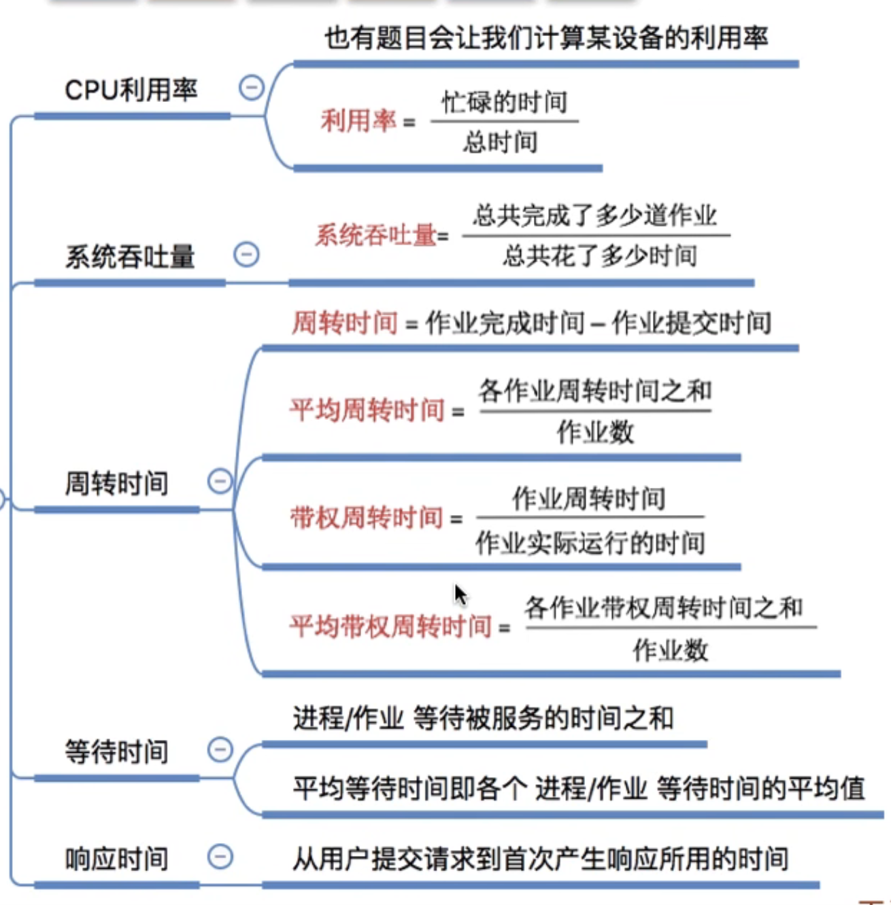

# 几种调度算法


## 时间片轮转调度算法


## 优先级调度算法

 
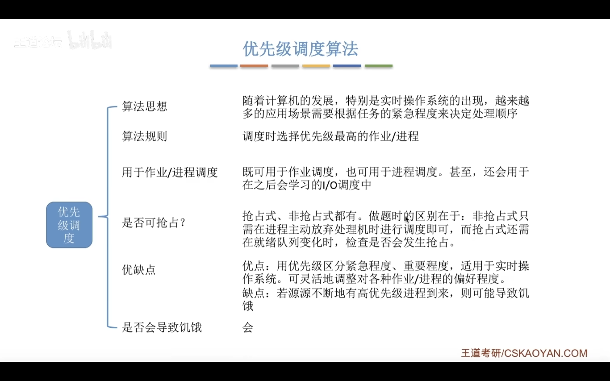

    非抢占性算法只需考虑进程主动放弃处理机的情况
    抢占性算法在每次就绪队列更新的时候也需要检测是否需要重新调度 


## 多级反馈队列调度算法

(UNIX 就是使用多级反馈队列调度算法)


分析这里每个队列选择的算法的原因(这只是个例子,并不是真是这样)

# 进程同步进程互斥

    一次仅允许一个进程使用的资源称为临界资源


```cpp
while(ture){
    entry section;//进入区<检查是否能进入>
    critical section; //临界区<访问临界资源的代码,又称为临界段>
    exit section; //退出区<将正在访问的标志清除>
    remainder section; //剩余区
}
```


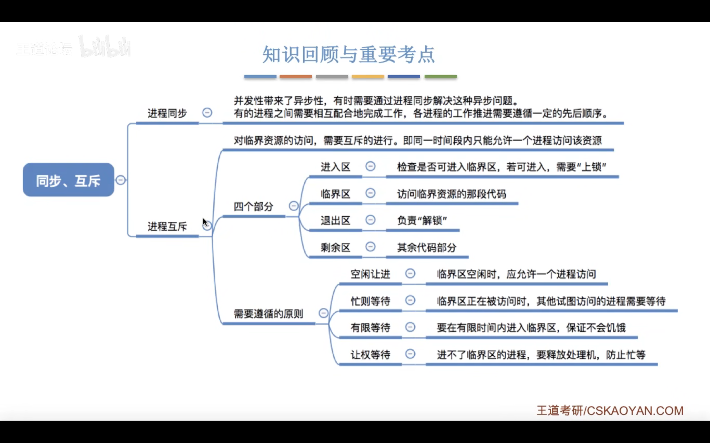


# 进程互斥的软件实现方法

---
设置一个公用的整型变量 turn,指向允许进入临界区的编号
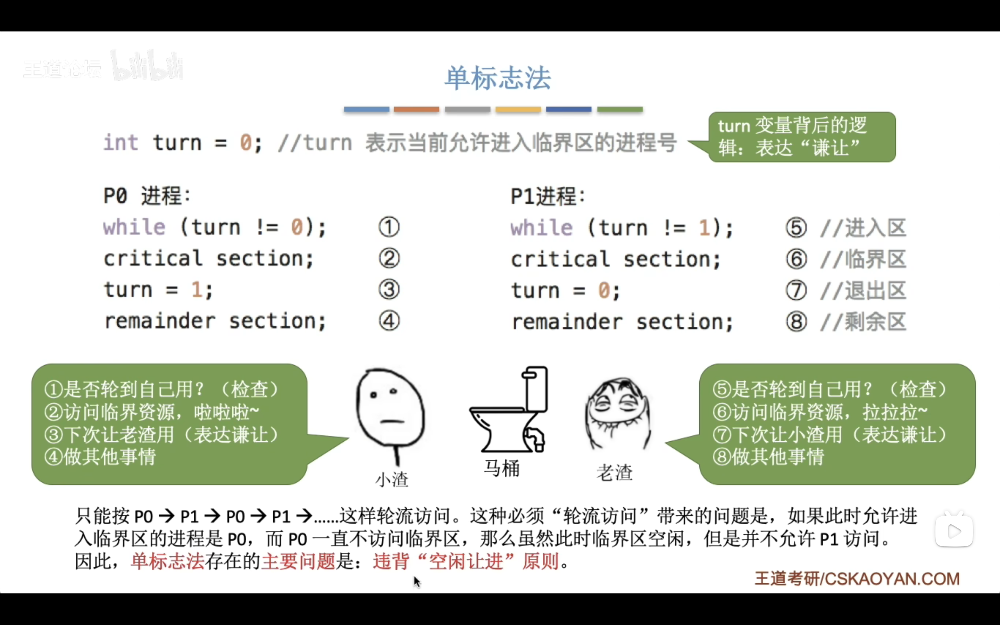
可以实现每次只允许一个进程进入临界区,但是两个程序比如交替进入临界区,如果某个程序不打算进入临界区,那么另一个也就不能再进入临界区,违背了<空闲让进>的原则

---
设置布尔型数组 flag[2] 标记双方进入的意愿,进入临界区之前先检查对方是否想进入,如果是就循环检查并等待,不是则置自己的 flag 为 true,然后访问临界区,退出的时候再置自己的 flag 为 false

这种做法不需要进程交替进入,可以连续使用,但是两个进程可能同时访问临界区,原因在于检查对方标志后到切换自己标志中可能发生进程切换,导致双方都检查通过,违背<忙着等待>原则

原因在于检查和设置不是一气呵成的


---
先设置自己的标志再检查对方

问题在于如果在设置自己标志和检查对方的时候发生了进程切换,那么两个程序都无法进入临界区,违背了<空闲让进>的原则,
此外两个进程长期得不到访问导致饥饿,违背了<有限等待>原则

---
结合算法 1,3.利用 flag 解决互斥问题,turn 解决饥饿问题.

进入之前将自己的 flag 置 true 然后 turn 设置为对方,如果 turn 是对方且对方想进就等待,否则进入,完成后置 flag 为 false

 唯一缺点是没有遵循<让权等待>

# 总结


# 进程互斥的硬件实现方法

中断屏蔽方法

TestAndSet 指令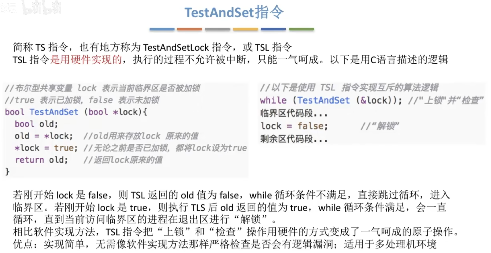

Swap指令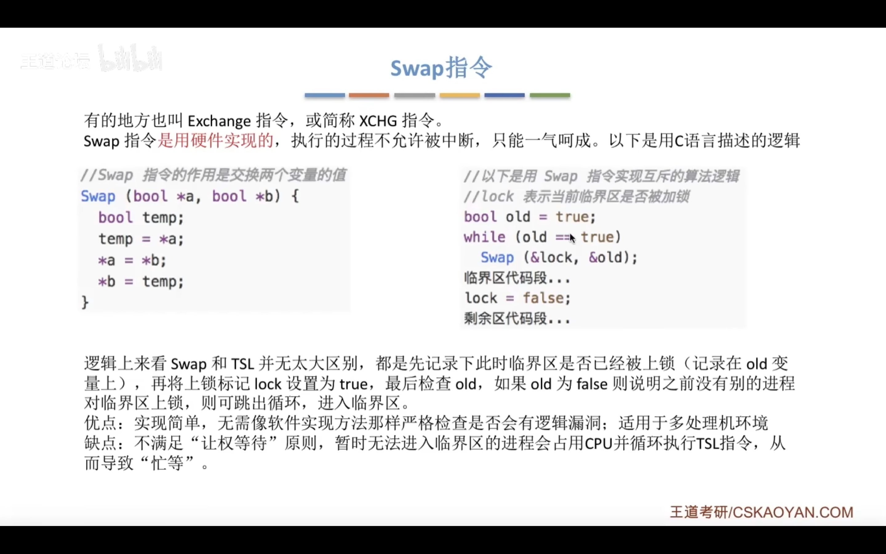

---

# 互斥锁


# 信号量机制


# 管程

实际上就是把对计算机的某种资源的描述,调用等等写成了一个类,其他进程想要对这种资源进行使用只能通过这个类

# 死锁

表示进程竞争资源陷入的一种僵局(等待对方手中的资源),使得各个程序都被阻塞


## 死锁产生的必要条件
        
    1.互斥条件:对互斥资源的争夺才会导致死锁
    2.不剥夺:进程所获的资源没有使用完之前不能被其他进程剥夺,
        只能该进程自己主动释放
    3.请求和保持条件:进程已经拥有了一个资源,同时还在请求其他资源,
        而请求的资源正在被其他进程占用,此时请求被阻塞但是自己已有的资源也不释放
    4.循环等待条件:存在一个资源的循环等待链,每个进程已经获得的资源在被下一个进程请求
    
*发生循环不一定死锁,但是死锁一定有循环等待*

对不可剥夺资源的不合理分配就有可能导致死锁

## 处理策略

1. 预防死锁。破坏死锁产生的四个必要条件中的一个或几个。

2. 避免死锁。用某种方法防止系统进入不安全状态，从而避免死锁（银行家算法）

3. 死锁的检测和解除。允许死锁的发生，不过操作系统会负责检测出死锁的发生，然后采取某种措 施解除死锁。

---

### 死锁总结


# 死锁处理


### 安全序列
就是指如果系统按照这种序列分配资源，则每个进程都能顺利完成。

### 安全状态
只要能找出一个安全序列，系统就是安全状态。当然，安全序列可能有多个。 

    如果分配了资源之后，系统中找不出任何一个安全序列，系统就进入了不安全状态。
    这就意味着之后 可能所有进程都无法顺利的执行下去。当然，如果有进程提前归还了一些资源，
    那系统也有可能重新 回到安全状态，不过我们在分配资源之前总是要考虑到最坏的情况。


#### 和死锁的关系

    如果系统处于安全状态，就一定不会发生死锁。
    如果系统进入不安全状态，就可能发生死锁
    处于不 安全状态未必就是发生了死锁，但发生死锁时一定是在不安全状态）


# 银行家算法


# 死锁解除


