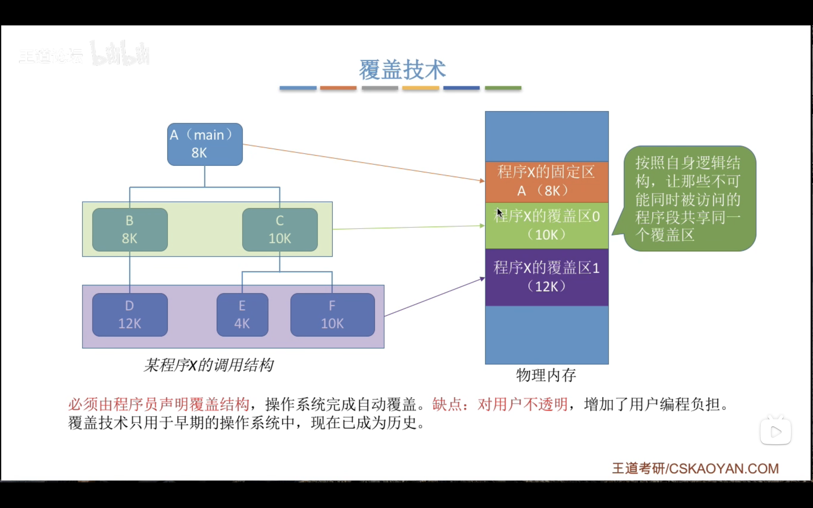
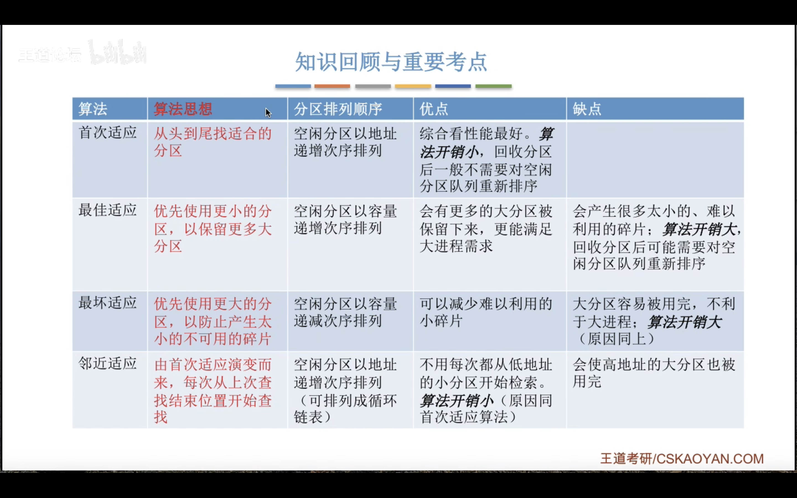
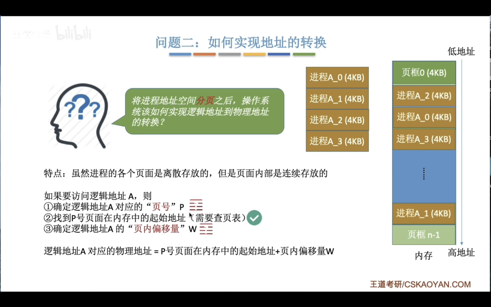
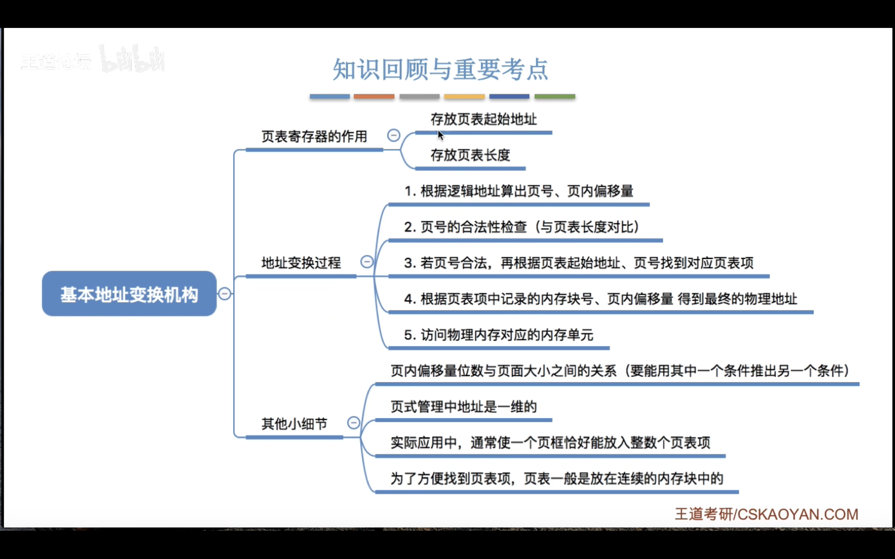

# 内存

内存可以存储数据,程序执行之前需要放进内存中--缓和 cpu 和硬盘之间速度的矛盾

    按字节编址那么每个存储单元的大小就是 1b,也就是 8 个 二进制位

    按字编址,每个存储单位就是一个字的大小(如果计算机字长是16 位,那就是 16 个二进制位 )

# 单位
$1GB=2^{10}MB=1024MB=2^{20}KB={1024}^2KB=2^{30}B$

# 内存管理的概念

---

# 内存空间的扩充

### 覆盖技术

    覆盖技术的思想:将程序分成多个段,常用的部分常驻内存,不常用的部分需要的时候调入内存

### 交换技术

    内存空间紧张的时候,把内存中某些进程暂时调出外存,把外存中某些具备运行条件的进程换入内存

### 总结

---

# 内存分配

### 连续分配

    为用户分配的是连续空间

#### 单一连续分配:

#### 固定分区分配

#### 动态分区分配
记录内存使用情况

如何选择分区分配

分配和回收

---

    内部碎片:分配给某个进程的内存中,某些部分没有被进程使用
    外部碎片:内存中的某些空闲分区由于太小而难以利用

---

# 总结

---

# 动态分区分配算法

## 首次适应算法

    每次都从低地址开始查找,直到找到满足大小的空闲分区

实现方法:空闲分区块按照起始地址从低到高排列,每次查找时按顺序查找,直到空闲分区大小足够

## 最佳适应算法

    尽量先分配大小小的空闲分区

实现方法:空闲分区按大小递增排列,查找时按顺序查找,直到进程可以被放入空闲分区

缺点:会留下越来越多的外部碎片,难以利用

## 最坏适应算法

    尽量先分配大小大的空闲分区(为了弥补最佳适应算法的缺点)

缺点:如果有大进程到达可能会无法分配

## 临近适应算法

    首次适应算法每次都从链头开始查找的。这可能会导致低地址部分出现很多小的空闲 分区，
    而每次分配查找时，都要经过这些分区，因此也增加了查找的开销。
    如果每次都从上次查找结束的位置开始检索，就能解决上述问题。

实现方法:空闲分区按地址递增排成循环链表

# 总结
最后还是首次适应最好用

---

# 分页存储管理

    将内存空间分成一个个大小相等的分区,每个分区就是一个页框(页帧)
        每一个页框有一个编号称为页框号,从 0 开始
    将进程的逻辑地址空间也分成一个个大小相等的部分,每个部分称为一个页,或者页面
        每个页也有一个编号,称为页号,从 0 开始
    
操作系统以页框为单位分配内存,进程的每个页放进一个页框中,也就是说,进程的页面和内存的页框一一对应(页表实现)    

页表:

# 总结

# 具有快表的地址变换机构

快表，又称联想寄存器（TLB，translation lookaside buffer ），是一种访问速度比内存快很多的高速缓存（TLB不是内存！），
用来存放最近访问的页表项的副本，可以加速地址变换的速度。 与此对应，内存中的页表常称慢表。

# 快表能提高效率的原因

# 总结

