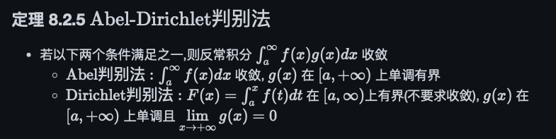
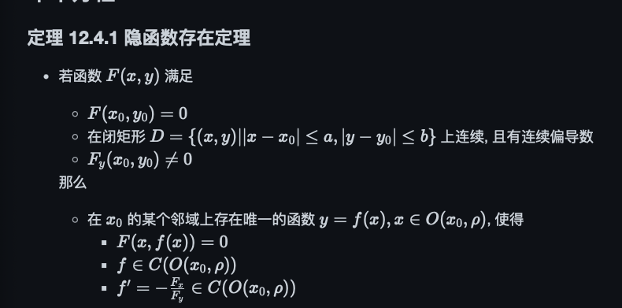
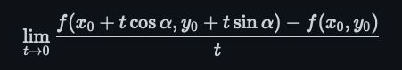

# 可能的问题

- 驻点,拐点,极值点 

    - 驻点是使得偏导数都是0的点
    - 拐点是使得二阶导数为0的点, 就是使得函数的凹凸性发生变化的点
    - 极值点就是局部最大值或者最小值
        - 显然, 极值点是驻点, 但是驻点不一定是极值点

- 一元函数可导可微连续的关系

    - 一元函数可导等价于可微
    - 可微一定连续, 但是连续不一定可微

- 多元函数可微是说

    - $\Delta z= A\Delta x + B\Delta y + o(\sqrt{\Delta x^2 + \Delta y^2})$

- 函数可积的充要条件有哪些

    - $\sum \omega_i\Delta x_i \to 0$
    - 振幅不能任意小的区间长度可以任意小
    - 达布上和下和相等
    - 不连续点的集合测度为0

- 反常积分的 Dirichlet 判别法

    - 

- 正项级数常用判别法

    - 比较判别法
    - 柯西判别法 (这个就是算上极限)
    - 达朗贝尔判别法 (这个收敛要 上极限小于1, 发散要下极限大于1)
    - 拉比判别法 (这个就是算极限)

- 幂级数在包含于其收敛域中的任意闭区间上一致收敛

- 黎曼积分和勒贝格积分的关系

    - 证明狄利克雷函数黎曼不可积, 但是勒贝格可积
        - 任意划分, 由有理数稠密, 上和为1 下和为0 

- 二重积分几何意义:求体积
- 三重积分集合意义:求质量

- 隐函数定理 

    - 

- 格林公式, 高斯公式, 斯托克斯公式

    - 格林公式: 第二类曲线积分和二重积分转化
        - $$\oint_{\partial D} Pdx+Qdy = \iint_D (Q_x-P_y)dxdy$$
    - 高斯公式: 第二类曲面积分和三重积分转化
        - $$\iiint_\Omega (\frac{\partial P}{\partial x}+\frac{\partial Q}{\partial y}+\frac{\partial R}{\partial z})dxdydz = \iint_{\partial \Omega} Pdydz+Qdzdx+Rdxdy$$
    - 斯托克斯公式: 第二类曲线积分和第二类曲面积分转化
        - $$\int_{\partial \Sigma} Pdx+Qdy+Rdz = \iint_{\Sigma} \begin{vmatrix} dydz & dzdx & dxdy \\ \frac{\partial}{\partial x} & \frac{\partial}{\partial y} & \frac{\partial}{\partial z} \\ P & Q & R \end{vmatrix} = \iint_{\Sigma} \begin{vmatrix} \cos\alpha & \cos\beta & \cos\gamma \\ \frac{\partial}{\partial x} & \frac{\partial}{\partial y} & \frac{\partial}{\partial z} \\ P & Q & R \end{vmatrix} dS$$

- 方向导数

    -  

