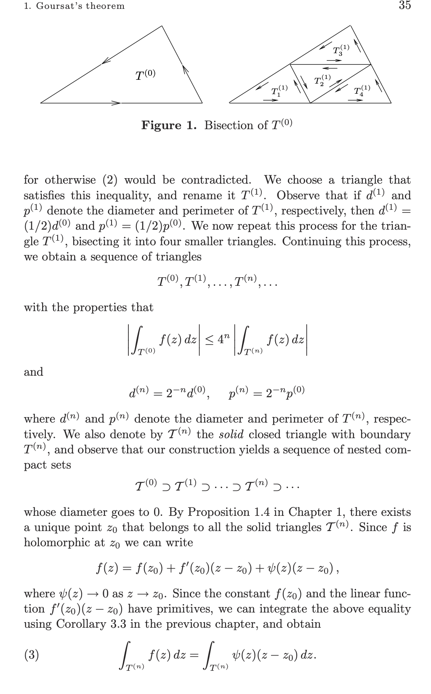
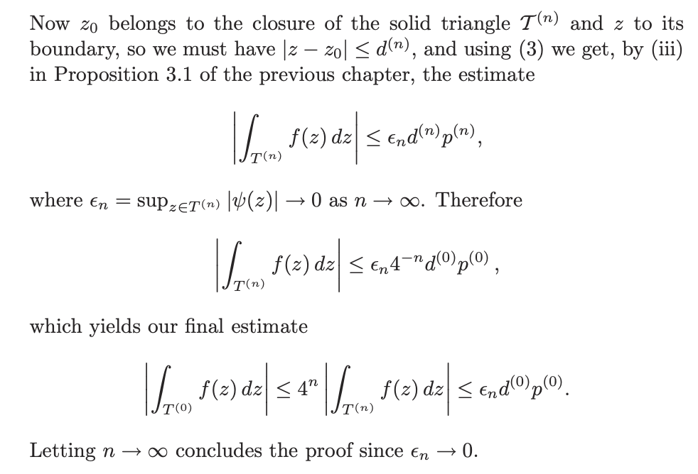
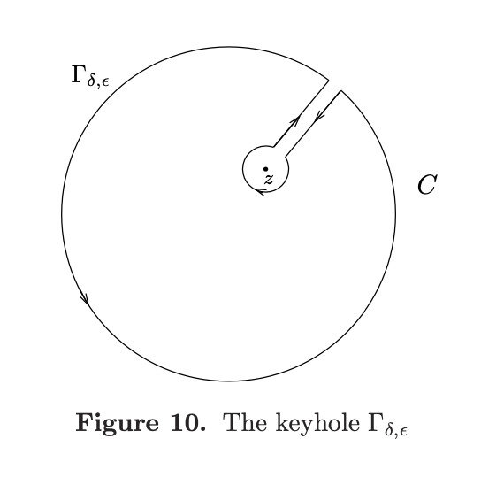

# 复变函数

#### 解析函数定义
$f$ 在 $z_0\in \Omega$ 处解析，如果下列极限收敛

$$\lim\limits_{h\to 0} \frac{f(z_0+h)-f(z_0)}{h}$$

也就是解析等价于复可微

#### 整函数
整函数是定义在整个复平面上的解析函数

#### 柯西黎曼方程
函数 $F(x,y)=u(x,y)+iv(x,y)$ 在 $P_0$ 处可微当且仅当 存在线性变换 $J:\mathbb{R}^2\to \mathbb{R}^2$ 使得

$$\frac{F(P_0+H))-F(P_0)}{H}=J(H)+o(|H|)$$

那么 $J$ 就是 $F$ 在 $P_0$ 处的导数

事实上如果 $F$ 在 $P_0$ 处可微，那么有以下条件成立

- $f'=\frac{\partial f}{\partial x}$
- $f'=\frac{1}{i}\frac{\partial f}{\partial y}$

    - 那么 $\frac{\partial f}{\partial x}=\frac{1}{i}\frac{\partial f}{\partial y}$

柯西黎曼方程:

$$\frac{\partial u}{\partial x}=\frac{\partial v}{\partial y}$$

$$\frac{\partial u}{\partial y}=-\frac{\partial v}{\partial x}$$

#### $f=u+iv$ 全纯的充分条件
- 如果$u,v$ 连续可微并且满足柯西黎曼方程，那么 $f$ 在 $z_0$ 处全纯

#### 幂级数收敛半径

$$\frac{1}{R}=\limsup |a_n|^{1/n}$$

#### 古萨定理
全纯函数在闭合三角形上的积分是0

- 证明: 分割三角形, 然后用全纯定义放缩
    - 
    -  

#### Morera定理
如果 $f$ 在 $\Omega$ 上连续并且对于 $\Omega$ 上的任意三角形有 $\oint_{\gamma} f(z)dz=0$, 那么 $f$ 在 $\Omega$ 上全纯

#### 柯西定理
$$\oint_{\gamma} f(z)dz=0$$

#### 柯西积分公式
若 $f$ 在一个包含圆 $C$ (取正向方向) 的区域上全纯, 那么对于任意 $z\in C$, 有

$$f(z)=\frac{1}{2\pi i}\oint_{C} \frac{f(\zeta)}{\zeta-z}d\zeta$$

- 证明: 考虑 $F(\zeta)=\frac{f(\zeta)}{\zeta-z}$, 在下面玩具曲线上的积分

    - 

> [!NOTE]
> 在复变函数中, 解析函数沿着闭曲线的积分是0, 实际上如果让虚部恒等于0, 那么积分退化成实数轴上的往返积分, 结果也是0.

#### 在复变中, 全纯意味着无穷次可微

$$f^{(n)}(z)=\frac{n!}{2\pi i}\oint_{C} \frac{f(\zeta)}{(\zeta-z)^{n+1}}d\zeta$$

#### 柯西不等式

$$|f^{(n)}(z)|\leq \frac{n!}{R^n}\sup |f|$$

##### 幂级数展开推导

$$\frac1{\zeta-z}=\frac1{\zeta-z_0-(z-z_0)}=\frac1{\zeta-z_0}\frac1{1-\left(\frac{z-z_0}{\zeta-z_0}\right)}$$

后者是一个几何级数, 再利用柯西积分公式

$$f(z)=\sum_{n=0}^\infty\left(\frac1{2\pi i}\int_C\frac{f(\zeta)}{(\zeta-z_0)^{n+1}}\:d\zeta\right)\cdot(z-z_0)^n$$

#### 刘维尔定理
有界整函数是常值函数

- 证明: 由柯西不等式立即得到

$$|f'(z)|\leq \frac{B}{R}$$

#### 代数基本定理
每一个 $n$ 次复数系数多项式都有 $n$ 个根

- 证明: 先证明有一个根, 然后用多项式除法, 递归证明

    - 若 $P(z)$ 没有根, 那么 $1/P(z)$ 有界并且是整函数, 由刘维尔定理, $1/P(z)$ 是常数, 矛盾

#### 获得全纯函数的方法

- 一致收敛的全纯函数列的极限是全纯函数(导函数也对应收敛)

- 通过积分得到全纯函数

#### 对称原理
若 $f^+,f^-$ 分别在上半平面和下半平面上全纯, 且在实轴上连续, 并且 $f^+(x)=f^-(x),x\in \mathbb{R}$, 那么可以得到一个新的全纯函数在 $\mathbb{C}$ 上全纯

$$f=\begin{cases}f^+(z),Im z\geq0\\f^-(z),Im z<0\end{cases}$$

## 奇点

#### 孤立奇点
若 $f$ 在 $z_0$ 的某个邻域上全纯, 但在 $z_0$ 处不全纯, 那么称 $z_0$ 是 $f$ 的孤立奇点

例如 $f(z)=\frac{1}{z}$, $z=0$ 是孤立奇点

#### 本性奇点
若 $f$ 在 $z_0$ 的任意邻域上都有无穷多个奇点, 那么称 $z_0$ 是 $f$ 的本性奇点

例如 $f(z)=e^{1/z}$, $z=0$ 是本性奇点

或者 $f(z)=\frac{1}{\sin\frac{1}{z}}$, $z=0$ 是本性奇点

#### 极点
若 $f$ 在 $z_0$ 的某个邻域上全纯, 且在 $z_0$ 处有有限阶的极点, 那么称 $z_0$ 是 $f$ 的极点

- 一个充要条件是 $z_0$ 是 $f$ 的极点 $\iff |f|\to \infty, z\to z_0$

- 并且 $f=\sum_{n=-m}^\infty a_n(z-z_0)^n$, $a_{-m}\neq 0$ 其中 $m$ 称为极点的阶数

    - 这里 $\sum\limits_{n=-m}^{-1} a_n(z-z_0)^n$ 称为主部, $a_{-1}$ 称为留数, 记为 $res f= a_{-1}$

我们有

$$\oint_{C} f(z)dz=2\pi i\cdot \text{res} f$$

- 计算留数的方法

    - 单极点: $\text{res} f=\lim_{z\to z_0}(z-z_0)f(z)$ 
    - $n$ 阶极点:$\text{res} f=\lim\limits_{z\to z_0}\frac{1}{(n-1)!}(\frac{d}{dz})^{n-1}[(z-z_0)^nf(z)]$, 这里 $n$ 是极点的阶

#### 留数定理
设 $f$ 在 $z_0$ 的某个邻域上除了有限个极点外全纯, 那么

$$\oint_{\gamma} f(z)dz=2\pi i\sum_{k=1}^n \text{res} f(z_k)$$

> [!NOTE]
> 于是判断函数在某个点的性质, 只需要计算极限 $\lim_{z\to z_0}f(z)$, 如果是有限值, 那么就是全纯的, 如果没有定义但是在领域上有界, 那么就是可去奇点, 如果无界就是极点, 都不是那么就是本性奇点

#### Casorati-Weierstrass 定理
若 $f$ 在 $z_0$ 的某个邻域上全纯, 且 $z_0$ 是 $f$ 的本性奇点, 那么 $f$ 在 $z_0$ 的任意邻域中的像集是稠密的(可以取到全体复值)

#### 亚纯函数
除去可列个极点外全纯的函数称为亚纯函数

- 我们称 $f$ 在无穷处有极点, 如果 $f(1/z)$ 在 $z=0$ 处有极点
- 在扩展复平面上(包括无穷点)亚纯函数是有理函数

#### 幅角原理
设 $f$ 亚纯, 在 $C$ 上没有零点和极点, 那么

$$\frac{1}{2\pi i}\oint_{C} \frac{f'(z)}{f(z)}dz=N-P$$

其中 $N$ 是 $f$ 在 $C$ 内部的零点个数(按重数计), $P$ 是 $f$ 在 $C$ 内部的极点个数(按重数计)

> [!NOTE]
> 极点的重数就是他的阶数 

#### Rouché定理
设 $f,g$ 在 $C$ 及其内部全纯, 且 $|f(z)|>|g(z)|,z\in C$, 那么 $f$ 和 $f+g$ 在 $C$ 内部有相同个数的零点

#### 开映射定理
若 $f$ 在 $\Omega$ 上全纯, 且 $f$ 在 $\Omega$ 上非常值, 那么 $f$ 将开集映射为开集

#### 最大模原理
若非常值函数 $f$ 在 $\Omega$ 上全纯, 那么 $|f(z)|$ 在 $\Omega$ 上没有最大值

> [!NOTE]
> 也就是在开集上取不到最值

#### 对数函数
主支对数函数是 $f(z)=\log|z|+i\arg z$, 其中 $\arg z$ 是 $z$ 的辐角并且满足 $-\pi<\arg z\leq \pi$

#### 平均值定理

$$f(z_0)=\frac{1}{2\pi}\int_0^{2\pi}f(z_0+re^{i\theta})d\theta$$

## 傅里叶变换

$$\hat{f}(\xi)=\int_{-\infty}^\infty f(x)e^{-2\pi i x\xi}dx$$

$$f(x)=\int_{-\infty}^\infty \hat{f}(\xi)e^{2\pi i x\xi}d\xi$$

复数形式的傅里叶展开

$$f(x)=\sum_{n=-\infty}^\infty c_ne^{inx}$$

其中 $c_n=\frac{1}{2\pi}\int_{-\pi}^\pi f(x)e^{-inx}dx$

$$C_n=\begin{cases}\frac{a_n-ib_n}{2} & n\geq 1\\ \frac{a_0}{2} & n=0\\ \frac{a_{-n}+ib_{-n}}{2} & n\leq -1\end{cases}$$

## 整函数

#### Jensen 公式
设 $f$ 在包含圆盘的闭包上的一个区域上全纯, 并且 $f$ 在圆盘边界上没有零点, 且 $f(0)\neq 0$, 若 $z_1,z_2,\cdots,z_n$ 是 $f$ 在圆盘内的零点, 那么

$$\log|f(0)|=\sum_{k=1}^n \log\frac{|z_k|}{R} + \frac{1}{2\pi}\int_0^{2\pi}\log|f(Re^{i\theta})|d\theta$$

#### 函数的阶

整函数 $f$ 的阶: $\rho_f=\inf\{\rho:\exists A,B,s.t. |f(z)|\leq Ae^{B|z|^\rho}\}$

#### Hadamard 定理
设整函数 $f$ 的阶为 $\rho$, 且 $k$ 满足 $k\leq \rho< k+1$, 用 $a_1,a_2,\cdots$ 表示 $f$ 的非零零点,那么有

$$f(z)=e^{P(z)}z^m\prod_{n=1}^\infty E_k\left(\frac{z}{a_n}\right)$$

其中 $P(z)$ 是次数不超过 $k$ 的多项式, $m$ 是 $z=0$ 作为零点的重数, $E_k(z)=(1-z)e^{z+\cdots+z^k/k},E_0(z)=(1-z)$

## 伽马函数, 黎曼 $\zeta$ 函数

#### 伽马函数
$$\Gamma(s)=\int_0^\infty e^{-t}t^{s-1}dt$$

可以用 $\Gamma(s)=\frac{\Gamma(s+1)}{s}$ 递归定义 $\{-\infty,\cdots,-3,-2,-1\}$ 的函数值

$$\Gamma(-n)=\frac{(-1)^n}{n!}$$

#### $\zeta$ 函数
$$\zeta(s)=\sum_{n=1}^\infty \frac{1}{n^s}=\prod_{p\text{ prime}}\frac{1}{1-p^{-s}}$$

