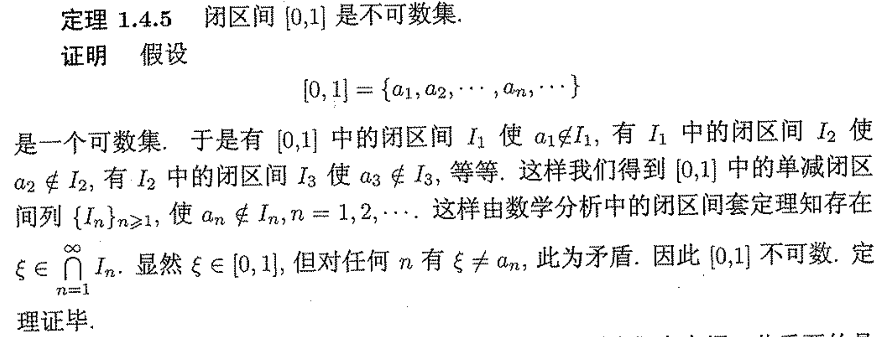

# 实变函数

## 序列极限

#### 上下极限的定义
设 $\{A_n\}$ 是集合序列, 定义其上下极限为

$$\overline{\lim\limits_{n\to\infty}}A_n=\bigcap\limits_{n=1}^{\infty}\bigcup\limits_{k=n}^{\infty}A_k$$

$$\underline{\lim\limits_{n\to\infty}}A_n=\bigcup\limits_{n=1}^{\infty}\bigcap\limits_{k=n}^{\infty}A_k$$

#### 判断点在不在上下极限中
- $x\in \overline{\lim} A_n \iff \forall N>0, \exists n>N, s.t. x\in A_n$

    - 即 $x$ 在 $A_n$ 中出现无穷多次

- $x\in \underline{\lim} A_n \iff \exists N>0, \forall n>N, s.t. x\in A_n$

    - 即集合序列中只有有限个集合不包含 $x$

- 上面意味着下极限包含在上极限中

#### 序列极限计算
若序列单调, 那么其上下极限就是序列的极限, 并且

$$\lim\limits_{n\to\infty}A_n=\begin{cases} \bigcup\limits_{n=1}^{\infty}A_n, & \text{单调递增} \\ \bigcap\limits_{n=1}^{\infty}A_n, & \text{单调递减} \end{cases}$$

#### 证明 $n$ 元数列具有连续统势
- $f:[0,1]\to \{n\text{元数列}\},s.t.f(x)=\{a_1,a_2,\cdots\}s.t.x=0.a_1a_2,\cdots$ 为 $n$ 进制表示

#### 证明可数集的子集全体有连续统势
- 只需要对 $\mathbb{N}$ 的子集进行证明, 
  - $f:A\to \{2\text{元数列}\},s.t.f(x)=\{a_1,a_2,\cdots\},a_i = \begin{cases} 1 & i\in A \\ 0 & i\notin A \end{cases}$
  - 建立了 $\mathbb{N}$ 到 $\{2\text{元数列}\}$ 的映射,后者具有连续统势

- 因此 $\mathbb{R}^n$ 有连续统势
- 全体实数列 $\mathbb{R}^{\mathbb{N}}$ 有连续统势
  
#### Bernstein定理
- 就是说集合势之间的比较和实数之间通常的大小比较有相同的性质
    - $\overline{\overline{A}} \leq \overline{\overline{A}}$
    - 若 $\overline{\overline{A}}\leq \overline{\overline{B}} \leq \overline{\overline{C}}$, 那么 $\overline{\overline{A}}\leq \overline{\overline{C}}$
    - 若 $\overline{\overline{A}}\leq \overline{\overline{B}},\overline{\overline{B}}\leq \overline{\overline{A}}$, 那么 $\overline{\overline{A}}=\overline{\overline{B}}$

#### 证明连续函数全体有连续统势
- 只需要证明 $[0,1]$ 上连续函数有连续统势即可, 令 $\mathcal{F}$ 为 $[0,1]$ 上连续函数全体

    - 首先对任意 $\lambda \in\mathbb{R},f_\lambda (x)=\lambda$ 是连续函数, 这说明 $c\leq \overline{\overline{\mathcal{F}}}$
    - 其次取 $[0,1]$ 中有理数全体 $\{r_n\}$, 对任意连续函数 $f\in\mathcal{F},\{f(r_n)\}$ 是实数列. 这建立了 $\mathcal{F}$ 到实数列全体的一个单射, 这说明 $\overline{\overline{\mathcal{F}}}\leq c$

#### 证明不存在基数最大的集合, 即 $\mu < 2^\mu$
- 取集合 $A$,其幂集记为 $P(A)$

    - $f:A\to P(A),s.t.f(x)=\{x\}$ 是单射, 这说明 $\mu \leq 2^\mu$
    - 其次若存在满射 $g:A\to P(A)$, 取 $A^*=\{x\in A:x\notin g(x)\}$, 因为 $g$ 是双射,于是存在唯一的 $x^*\in A,s.t.g(x^*)=A^*$ 可以说明, 不管 $x^*$ 在不在 $g(x^*)$ 中,都有矛盾

#### 开集
- 定义:每一个点都是内点
- $\mathbb{R}$ 中的开集至多是可数个两两不交的开区间的并

    - $\mathbb{R}^n$ 中的开集是可数个两两不相交的半开长方体的并 

#### 闭集
- 补是开集的集合
- 集中任何点列如果有极限,那么一定收敛到集合内

#### 完备集
- 定义:没有孤立点的闭集
    - $F$ 是 $\mathbb{R}$  的完备集当且仅当 $F^c$ 至多是可数个两两不交且端点不重合的开区间的并
        - 这里要求端点不重合是因为 $F$ 没有孤立点

#### 稠集
- 定义:任意开子集都和其交非空
    - 当且仅当其闭包是全季

#### 疏集
- 任意开集都有非空子集和其交为空
    - 当且仅当其闭包的内核是空集

#### Cantor 完备集的构造及其性质
- $C=[0,1]-G,G=\bigcup \{I_{n,k}:1\leq k\leq 2^{n-1},n\geq 1\}$ 是两两不交且端点不重合的开区间的并, 于是 $C$ 是完备集
    - $C$ 没有内点(显然任何领域和 $G$ 有交)
    - $G$ 是稠集, 任意开区间都和 $G$ 有交, 且 $|G|=\sum\limits_{n=1}^{\infty}\frac{2^{n-1}}{3^n}=1$

- 上面说明 $C$ 的测度是 $0$, 但是它却具有连续统势

    - 事实上对任意 $x\in [0,1],x=\sum\limits_{n=1}^\infty\frac{a_n}{3^n}$, $I_{1,k}$ 中点 $a_1=1$,  $I_{n,k}$ 中的点 $a_n=1$, 于是所有由 $0,2$ 组成的三元数列全体的子集都在 $C$ 中,这相当于二元数列全体, 从而 $C$ 有连续统势

- 开拓的 $Cantor$ 函数

    - $f(x)=\frac{2k-1}{2^n},x\in I_{n,k},f(0)=0,f(1)=1$

## Lebesgue测度

- 勒贝格积分和黎曼积分的区别在于:黎曼积分是通过分割区间,然后求和,而勒贝格积分是通过分割函数值,然后求和

#### Lebesgue外测度
- 集合 $E$ 的外测度定义为

$$m^*(E)=\inf\left\{\sum\limits_{n=1}^\infty l(I_n):E\subset \bigcup\limits_{n=1}^\infty I_n,I_n\text{是开区间}\right\}$$

> [!NOTE]
> 因为我们只对开区间(闭区间)定义了测度(长度)

#### 外测度的性质
- 可数集的外测度为 $0$
- 单调性: $E\subset F\Rightarrow m^*(E)\leq m^*(F)$
- 次可加性: $m^*(\bigcup\limits_{n=1}^\infty E_n)\leq \sum\limits_{n=1}^\infty m^*(E_n)$

#### 可测集
- 定义: $E$ 是可测集当且仅当对任意 $A\subset \mathbb{R}$,有 $m^*(A)\geq m^*(A\cap E)+m^*(A\cap E^c)$
    - 事实上反过来的不等式是恒成立的(次可加), 于是
    - $E$ 可测当且仅当 $m^*(A)=m^*(A\cap E)+m^*(A\cap E^c),\forall A$

- 可测集的外测度称为其测度

#### 可测集的性质
- 可测集的补,交,并(至多可数)都是可测集

#### 不可测集的例子

利用等价关系 $x\sim y \iff x-y\in \mathbb{Q}$, 和选择公理

- 首先 $\sim$ 把 $[0,1]$ 划分成等价类的并, 在每一个等价类中选取一个代表元, 由选择公理可知存在这样的选择, 组成集合 $F$

- 对 $F$ 做平移 $F_n={x+r_n:x\in F},\{r_n\}$ 是 $[-1,1]$ 上的有理数全体, 可以证明 $F_n$ 两两不交, 且 $[0,1]\subset \bigcup\limits_{n=1}^\infty F_n\subset [-1,2]$

    - 假设 $F$ 可测, 由于 $F_n$ 两两不交并且由测度平移不变性可知 $m(F_n)=m(F)$, 于是有

        - $$1\leq m([0,1])\leq \sum\limits_{n=1}^\infty m(F_n)=\sum\limits_{n=1}^\infty m(F) \leq m([-1,2])=3$$
        - 这使得无论 $m(F)$ 取什么值都会产生矛盾, 从而 $F$ 不可测

#### Lebesgue可测但是不是Borel可测的例子
- 首先 Lebesgue测度是完备的, 所谓完备就是说零测集的任意子集都是可测集
- 其次我们知道 Cantor集是零测的, 并且具有连续统势

    - 已经知道 Cantor 函数是连续不减的, 令 $g(x)=\frac{f(x)+x}{2}$, 那么 $g$ 是连续严格增的函数, 从而 $g$ 把 Borel 集映到 Borel 集合
    - 考虑不可测集 $F$ 在 $g$ 下的原像, $g^{-1}(F)\subset C$, 由勒贝格测度完备性可知 $g^{-1}(F)$ 是可测集, 但是 $g^{-1}(F)$ 不是 Borel 集

        - 因为如果是, 那么 $F$ 就是 Borel 集, 从而可测, 那就矛盾

