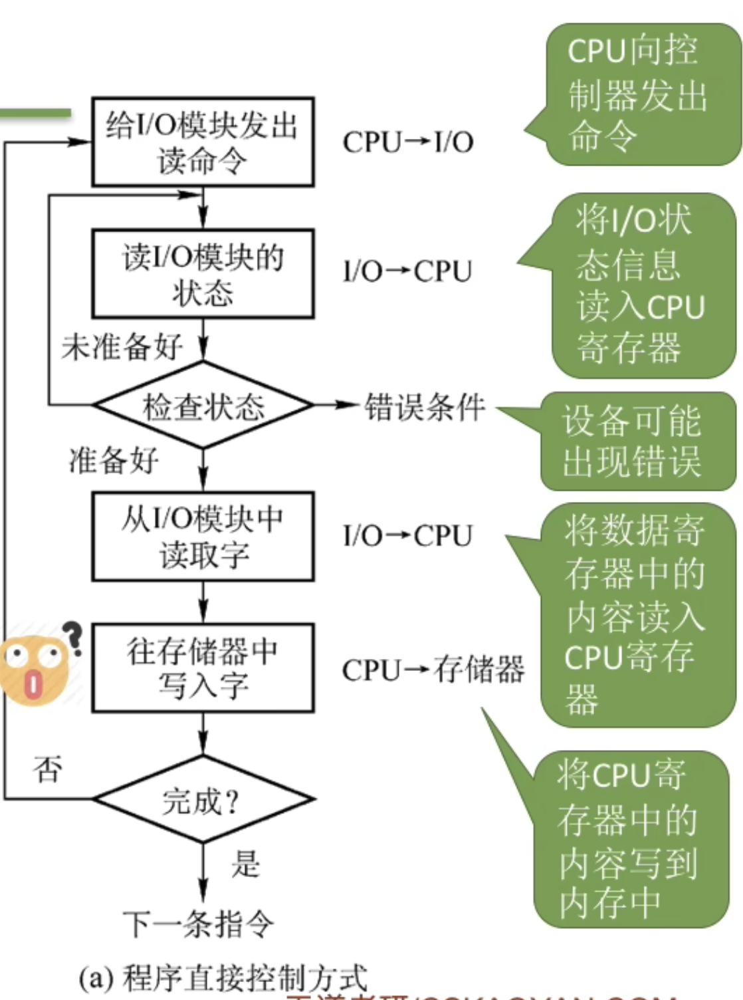
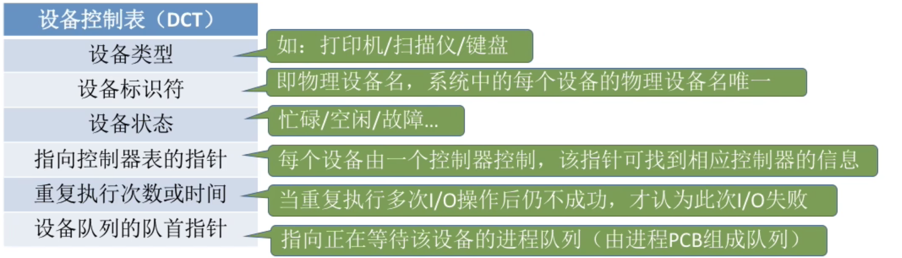
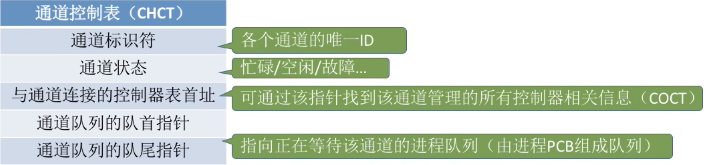

# 设备管理
## I/O 设备的基本概念和分类
- 按特性分类
  - 人机交互类
    - 鼠标,键盘,打印机
      - 数据传输速度慢
  - 存储设备
    - 移动硬盘
      - 数据传输速度快
  - 网络通信设备
    - 路由器
      - 介于前两者之间
- 按传输速率分类
  - 低速设备
    - 键盘,鼠标
  - 中速设备
    - 打印机
  - 高速设备
    - 硬盘,网卡
- 按信息交换单位分类
  - 块设备
    - 硬盘
  - 字符设备
    - 键盘,鼠标

## I/O控制器
- I/O 控制器的功能
  - 接受识别 cpu 的命令
    - 控制寄存器放置 cpu 传达的命令
  - 向 cpu 报告命令状态
    - 状态寄存器放置 I/O 设备的状态
  - 数据交换
    - 数据寄存器用于暂存数据
  - 地址识别
    - 实现 cpu 和各种寄存器之间的交互

- I/O 控制器的组成
  - cpu 和控制器的接口
    - 实现 cpu 和控制器的通信
  - I/O 逻辑
    - 负责接收并识别 cpu 的命令,并对设备发出命令
  - 控制器和设备的接口
    - 实现控制器和设备的通信

## I/O控制方式
- 程序直接控制方式
  - 
  - cpu 需要不断轮询检查设备状态
  - 每次读一个字
  - 优点:实现简单,缺点:cpu 和 I/O 设备只能串行工作,效率低
- 中断驱动方式
  - 
  - 引入中断机制,在 I/O 设备操作的时候 cpu 可以做别的事情,当 I/O 设备完成操作后,直接唤醒等待 I/O 的进程
  - 优点:提高了效率,缺点:每次只能传一个字,当数据太多的时候需要很多的中断,也会影响效率
- DMA 方式
  - (直接存储器存取:Direct Memory Access) 
    - 数据传送单位是:块
    - 数据流向不需要经过:cpu
    - cpu 干预:只需要在开始和结束时干预
  - 
  - 仅在开始和结束时 cpu 参与,中间的数据传输不需要 cpu 参与
  - 优点:提高了效率(块为单位),缺点:cpu 每次发出一个 I/O 指令,只能读写一个或者多个**连续**的数据块,读写离散数据时需要发多个 I/O 指令
- 通道控制方式
  - 通道:一种硬件,可以识别一系列的通道指令
  - 
  - 优点:cpu,通道,I/O 设备可以并行工作,效率高.缺点:实现复杂,需要专门的硬件支持
- 

## I/O软件层次结构

- 用户层软件
  - 一般是提供与 I/O 相关的库函数
  - 使用设备独立性软件向上提供的系统调用服务
    -  ex:print 会被翻译成 write 系统调用
- 设备独立性软件
  - 又被称为设备无关性软件
  - 需要提供系统调用
  - 实现设备保护
    - 设备被看作特殊的文件,因此有访问权限
    - 差错处理(硬件故障)
    - 设备的分配与回收
    - 数据缓冲区管理
    - 建立逻辑设备名到物理设备名的映射,以及调用相关的驱动程序
- 设备驱动程序
  - 由设备制造商提供
- 中断处理软件
  - I/O 应答中断
- 硬件
  - 执行 I/O 操作

## 输入输出程序接口,设备驱动程序接口

- 输入输出程序接口
    在执行系统调用的时候,由于底层硬件的不同,需要提供不同的接口,比如硬盘支持序列但是键盘显然是不支持的,因此不可能提供一个单一的系统调用接口给上层用户
    
  - 字符设备接口
    - get/put系统调用
  - 块设备接口
    - read/write 系统调用,seek修改读写指针位置
  - 网络设备接口
    - 网络套接字接口:socket接口.把套接字绑定到某个本地端口上
    - 
  - 概念:什么是阻塞/非阻塞 I/O
    - 阻塞 I/O:当一个进程发出一个 I/O 请求后,进程会一直等待直到 I/O 完成,比如从键盘读取字符
    - 非阻塞 I/O:当一个进程发出一个 I/O 请求后,系统调用会被迅速返回,进程无需阻塞等待,比如往磁盘写数据

- 设备驱动程序接口
  - 

## I/O核心子系统

- 

## SPOOLing技术
- 脱机技术
  - 
  - 脱离主机的控制进行输入输出
- 假脱机技术(SPOOLing 技术)
  - 
  - 
- 

## 设备的分配和回收
- 设备分配应该考虑的因素
  - 设备固有属性
    - 独占设备:一个时间内只能分配给一个进程使用(打印机)
    - 共享设备:可同时分配给多个进程(磁盘)
    - 虚拟设备:使用 SPOOLing 技术把独占设备改进成的共享设备
  - 设备分配算法
    - 先来先服务等等
  - 设备分配中的安全性
    - 安全分配方式:为进程分配一个设备之后就把进程阻塞,直到I/O操作完成再唤醒
      - 一个时间段内一个进程只能访问一个设备
      - 优点是破坏了"请求和保持"条件,不会发生死锁
      - 缺点是对一个进程来说,CPU 和 I/O 设备只能串行工作,效率低
    - 不安全分配方式:为进程分配一个设备之后,进程可以继续执行,除非某个 I/O 操作得不到满足,进程才会被阻塞
      - 优点是cpu 和 I/O 设备可以并行工作,效率高
      - 缺点是有可能发生死锁(可以用死锁检测和解除来解决)
- 静态分配和动态分配
  - 静态分配:在进程运行之前就分配全部资源,运行结束后归还全部资源
    - 破坏了"请求和保持"条件,不会发生死锁
  - 动态分配:进程运行中动态分配资源
- 设备分配中的数据结构
  - 一个通道控制多个控制器,一个控制器控制多个设备
  - **设备控制表(DCT)**,记录设备情况
    - 
  - **控制器控制表(COCT)**,对控制器进行管理
    - 
  - **通道控制表(CHCT)**
    - 
  - **系统设备表(SDT)**,记录全部设备的情况
    - 
- 设备分配的步骤
  - 
  - 
  - 
- 设备分配的改进方法
  - 
  - 
- 

  

