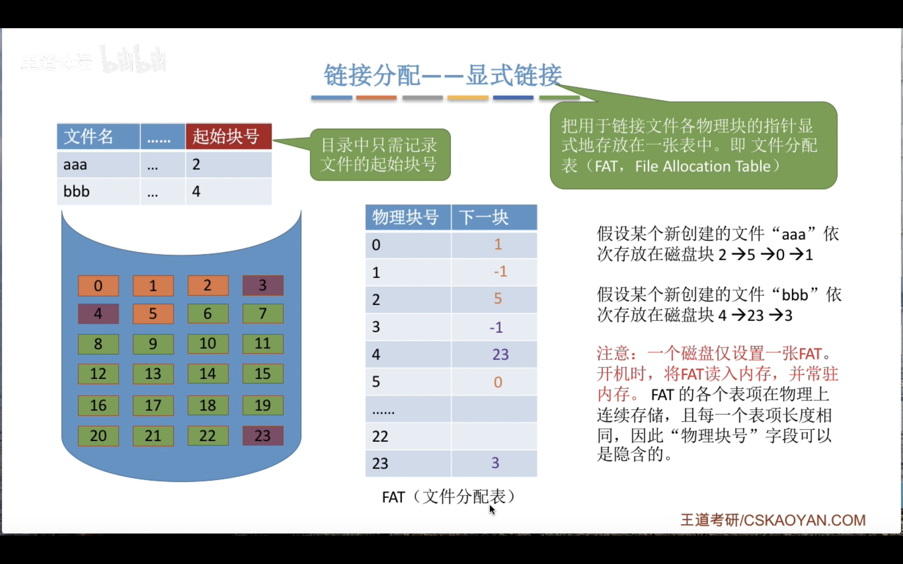

# 文件管理

## 文件的属性

- 文件名:用户最直观的感知
- 标识符:操作系统内部用于区分各个文件的标志,对用户没有可读性
- 类型:txt,py..
- 位置,大小,创建者等等

- 文件内部数据组织形式
    
    - 流式文件:无结构文件,由二进制字符流组成,如 txt 文件

    
    - 记录式文件:有结构文件.如xlsx文件
    
        - 文件之间的逻辑结构?

- 操作系统向上提供文件的最基本功能
    
    - 创建文件:creat 系统调用
    - 删除文件:delete 系统调用
    - 打开文件:open 系统调用
    - 关闭文件:close 系统调用
    - 读文件:read 系统调用
    - 写文件:write 系统调用

- 外存中文件的组织形式

    类似于内存分为一个个“内存块”，外存会分为一个个“块/磁盘块/物理块”。
    每个磁盘块的大小是相等的，每块一般包含2的整数幂个地址
    同样类似的是，文件的逻辑地 址也可以分为(逻辑块号，块内地址)
    操作系统同样需要将逻辑地址转 换为外存的物理地址(物理块号，块内地址)的形式。
    块内地址的位数取决于磁盘块的大小

## 文件的逻辑结构

- 有结构文件的逻辑结构

    - 顺序文件:
        
        - 文件中的记录是按照某种顺序(顺序表或者链表之类的)排列的,可以是定长也可以是变长
        - 串结构:记录之间的顺序与关键词无关
        - 顺序结构:记录之间的顺序按关键词顺序排列
            
            -  
    
    
    - 索引文件:
    
        - 顺序文件的查找效率较低,因此引入索引文件:建立一个索引表(定长记录的顺序文件),索引表中的每个记录包含一个关键字和一个指向对应数据记录的指针
    
    - 索引顺序文件:
    
        - 建立多级索引表以提高查找效率
    
- 

## 文件目录

- 文件控制块:

    - 目录实际上也是一种数据结构
    - FCB 文件控制块:即目录文件中的一个记录
        
        - 每个文件对应一个 FCB(类似 PCB)
        - 最重要的数据是文件名和文件的地址

    - FCB 的有序集合就是文件目录
    
    - 对目录的操作:
        
        - 搜索,创建,删除文件,显示目录,修改目录

- 目录结构

    - 单级目录结构:

        - 不允许文件重名,无法处理多用户

    - 两级目录结构:

        - 为每个用户建立一个文件夹,则可以处理不同用户之间需要相同文件名的需求
        - 此外还能设置权限设置
        - 缺点在于用户不能对自己的文件分类

    - 多级目录结构:
        
        - 解决上述问题
        - 但不便于文件共享

    - 无环图目录结构:

        - 可以用不同的用户名指向同一个文件(目录)
        -  

- 索引节点(FCB 的改进 )

    - 在使用文件名搜索的时候并不关心除了文件存在性的其他性质,因此可以对 FCB 进行"瘦身"
    - 使用 map:文件名$\to$索引节点指针(指向文件的其他属性)

-  

## 文件的物理结构

- 操作系统对磁盘的管理:空闲和非空闲的磁盘块

    - 磁盘中的空间也分成了很多磁盘块,和内存块相同(很多时候设置和内存块大小相等,这样方便将外存读入内存 )
    - 文件的逻辑地址空间也被划分成了块

- 连续分配

    - 每个文件在磁盘上有连续的块
    -  
    - 磁盘需要读取数据的时候需要移动磁盘头,两个磁盘块相隔越远需要的时间就越长,所以连续分配所需要的移动磁头的时间就最少
        
        - 连续分配方式在顺序读写的时候最快

    - 缺点:
        - 拓展文件可能需要整体迁移文件

            -  
        
        - 产生很多磁盘碎片

            -  

    - (总结)连续分配方式要求每个文件在磁盘上占有一组连续的块。
        
        - 优点:支持顺序访问和直接访问(即随机访问);连续分配的文件在顺序访问时速度最快 
        - 缺点:不方便文件拓展;存储空间利用率低,会产生磁盘碎片

- 链接分配

    - 隐式链接:

        - 目录记录了文件的起始块号和终止块号
        - 除了文件最后一个磁盘块,每个磁盘块都有一个指向下一个磁盘块的指针(单链表)

            -不支持随机访问,只能顺序访问(查找效率低)

        - 这些指针对用户来说实际上是透明的
        - 拓展文件是很方便的,不会产生碎片,外存的利用率高

    - 显示链接:

        - 把链接各个文件的指针显示的存放在文件分配表(FAT:File Allocation Table)中
        - 目录只需要记录起始块号
            
            -  

        - *逻辑块号到物理块号之间不需要读磁盘!*
            
            - 支持顺序访问也支持随机访问
            - 相比隐式链接快很多,也不会有碎片
            - 唯一的缺点就是文件分配表需要占用一定的存储空间

- 索引分配

    - 索引分配允许文件离散的分布,操作系统为每个文件建立一张索引表,记录每个逻辑地址块对应的物理块.索引表存放的磁盘称为索引块 ,数据存放的盘称为数据块
    - 文件 FCB 就只需要记录索引块(第几个磁盘块)的位置
    - 注：在显式链接的链式分配方式中,文件分配表FAT是一个磁盘对应一张.而索引分配方式中,索引表是一个文件对应一张。
    - 读取方法:用户给出逻辑块号$i\to$读取 FCB 找到索引表 $\to$ 读取物理块号并访问即可
    - 支持随机访问,容易拓展文件,不会产生碎片
    - 缺点:索引表需要额外的存储空间

    - 当一个文件的大小超过一个索引块的容量时,一个磁盘块就放不下索引表了,此时可以

        - 1.链接方案

            - 将多个索引块链接起来,在每一个索引块中存放下一个索引块的地址即可
            - FCB 记录第一个索引块的地址
            
                - 不支持随机访问,只能顺序访问.因为下一个索引块的地址在上一个索引块中,必须要把前一个索引块读入内存才能知道下一个索引块的地址
                - 因此低效

        - 2.多层索引

            - 建立多级索引表,父表指向子表,子表指向数据块
                -类似于多级页表
                    -  
                
            - 缺点:尽管文件的大小很小,也还是需要多次 I/O 操作,因为需要从父目录索引下去

        - 3.混合索引

            - 多种索引方式的结合,一个文件的顶级索引表中即可能有直接索引(指向数据)
                也可能有一级索引,二级索引等等

    -  

- 总结: 

## 逻辑结构&物理结构

