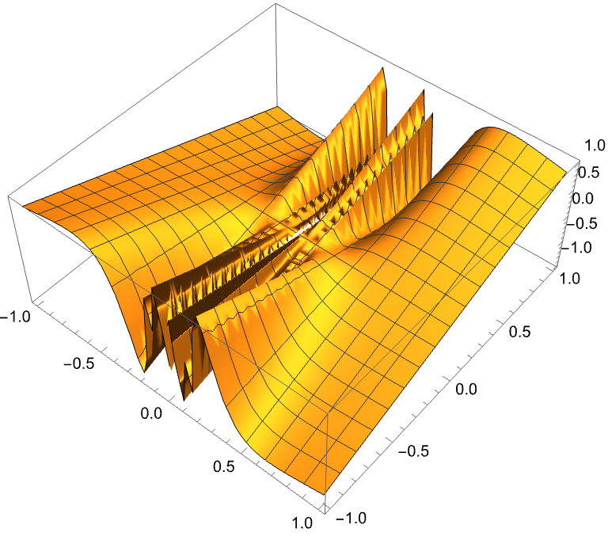

# $\text{Euclid}$ 空间上的极限和连续

### $\text{Euclid}$ 空间上的距离与极限

#### 定义 11.1.1
- $\text{Euclid}$ 空间 $R^n$ 中任意两点 $\vec{x},\vec{y}$ 之间的距离定义为
    - $$|\vec{x}-\vec{y}| = \sqrt{\sum_{i=1}^{n}(x_i-y_i)^2}$$  
    并称 
    - $$||\vec{x}|| = \sqrt{\sum_{i=1}^{n}x_i^2}$$
    为 $\vec{x}$ 的 $\text{Euclid}$ 范数 (模长)

#### 定理 11.1.1
- 距离满足以下性质
    - 正定性: $|\vec{x}-\vec{y}|\geq 0$,且 $|\vec{x}-\vec{y}|=0\iff \vec{x}=\vec{y}$
    - 对称性: $|\vec{x}-\vec{y}|=|\vec{y}-\vec{x}|$
    - 三角不等式: $|\vec{x}-\vec{y}|+|\vec{y}-\vec{z}|\geq |\vec{x}-\vec{z}|$

#### 定义 11.1.2 邻域
- 设 $\vec{a} = (a_1,a_2,\cdots,a_n)\in R^n,\delta >0,$ ,则点集
    - $$O(\vec{a},\delta) = \{\vec{x}\in R^n:|\vec{x}-\vec{a}|<\delta\}$$
    称为点 $\vec{a}$ 的 $\delta$ 邻域

#### 定义 11.1.3 极限
- 设 $\{\vec{x}_n\}$ 是 $R^n$ 中的一个点列, $\vec{a}\in R^n$,如果对任意 $\varepsilon>0$,存在 $N\in \mathbb{N}$,使得当 $n>N$ 时,有
    - $$|\vec{x}_n-\vec{a}|<\varepsilon$$
    则称 $\vec{a}$ 是点列 $\{\vec{x}_n\}$ 的极限,记为
    - $$\lim_{n\to\infty}\vec{x}_n = \vec{a}$$
- 点列不收敛就称为发散

#### 定理 11.1.2
- $\lim\limits_{n\to\infty}\vec{x}_n = \vec{a} \iff \lim\limits_{n\to\infty}(x_k)_i=a_i$

#### 定义 11.1.4
- 设 $S\subset R^n$, 若存在正数 $M$, 使得对任意 $\vec{x}\in S$ 有 $||\vec{x}||\leq M$, 则称 $S$ 为有界集

### 开集和闭集

- 对 $\vec{x}\in R^n,S\subset R^n$
    - 若存在 $\delta>0$, 使得 $O(\vec{x},\delta)\subset S$, 则称 $\vec{x}$ 为 $S$ 的内点
    - 若存在 $\delta>0$, 使得 $O(\vec{x},\delta)\cap S=\emptyset$, 则称 $\vec{x}$ 为 $S$ 的外点
   
   - 若任意 $\vec{x}$ 的邻域都既包含 $S$ 中的点又包含 $S$ 外的点, 则称 $\vec{x}$ 为 $S$ 的边界点

    - 若存在 $\vec{x}$ 的邻域 $O(\vec{x},\delta)$ 使得 $O(\vec{x},\delta)\cap S=\{\vec{x}\}$, 则称 $\vec{x}$ 是孤立点
    
    - 若 $\vec{x}$ 的任何邻域都包含 $S$ 中无穷多个点,则称 $\vec{x}$ 为聚点

#### 定理 11.1.3
- $\vec{x}$ 是 $S$ 聚点的充要条件是:存在 $S$ 中的点列,收敛到 $\vec{x}$

#### 定义 11.1.5
- 若 $S$ 中的点都是内点,则称 $S$ 为开集
- 若 $S$ 包含了其所有聚点,则称 $S$ 为闭集
    - $S$ 和其聚点全体 $S'$ 的并集称为 $S$ 的闭包, 记为 $\bar{S}$

> [!NOTE]
> 以后记 $S\underset{closed}{\subset}T$ 表示 $S$ 是 $T$ 的闭子集,
> $S\underset{open}{\subset}T$ 表示 $S$ 是 $T$ 的开子集

#### 定理 11.1.4
- $S\underset{closed}{\subset} R^n \iff S^c\underset{open}{\subset} R^n$

#### 引理 11.1.1 $\text{De Morgan}$ 定律}
- 设 $\{S_\alpha\}$ 是 $R^n$ 的子集族, 则
    - $$\left(\bigcup_{\alpha}S_\alpha\right)^c = \bigcap_{\alpha}S_\alpha^c$$
    - $$\left(\bigcap_{\alpha}S_\alpha\right)^c = \bigcup_{\alpha}S_\alpha^c$$

#### 定理 11.1.5
- 开集对的任意并和有限交封闭
- 闭集对的任意交和有限并封闭

### $\text{Euclid}$ 空间上的基本定理

- 推广,以 $n=2$ 为例

#### 定理 11.1.6 闭矩形套定理
- 设 $\Delta_k = [a_k,b_k]\times [c_k,d_k]$ 是 $R^2$ 上的闭矩形,如果
    - $$\Delta_1\supset \Delta_2\supset \cdots \supset \Delta_k\supset \cdots$$
    - $$\lim_{k\to\infty}(b_k-a_k)=0,\lim_{k\to\infty}(d_k-c_k)=0$$
    则存在唯一一点 $\vec{a}=(\xi,\eta)$ 属于所有 $\Delta_k$ 且
    - $$\lim_{k\to\infty}a_k=\lim_{k\to\infty}b_k=\xi$$
    - $$\lim_{k\to\infty}c_k=\lim_{k\to\infty}d_k=\eta$$

#### 定理 11.1.6 $\text{Cantor}$ 闭区域套定理
- 设 $\Delta_k$ 是 $R^n$ 上的闭区域,如果
    - $$\Delta_1\supset \Delta_2\supset \cdots \supset \Delta_k\supset \cdots$$
    - $$\lim_{k\to\infty}\text{diam}(\Delta_k)=0$$
    则存在唯一一点 $\vec{a}$ 属于所有 $\Delta_k$
       
    - 这里 $\text{diam}(\Delta_k) = \sup\{|\vec{x}-\vec{y}|:\vec{x},\vec{y}\in \Delta_k\}$

#### 定理 11.1.7 $\text{Bolzano-Weierstrass}$ 定理
- $R^n$ 上有界点列必有收敛子列

#### 推论 11.1.1
- $R^n$ 上有界无限点集必有聚点

#### 定义 11.1.6 $\text{Cauchy}$ 列
- 设 $\{\vec{x}_n\}$ 是 $R^n$ 中的点列,如果对任意 $\varepsilon>0$,存在 $N\in \mathbb{N}$,使得当 $n,m>N$ 时,有
    - $$|\vec{x}_n-\vec{x}_m|<\varepsilon$$
    则称 $\{\vec{x}_n\}$ 是 $\text{Cauchy}$ 列

#### 定理 11.1.8 $\text{Cauchy}$ 收敛原理
- $R^n$ 中的点列 $\{\vec{x}_n\}$ 收敛的充要条件是 $\{\vec{x}_n\}$ 是 $\text{Cauchy}$ 列

### 紧集

#### 定义 11.1.7
- $S\subset R^n,U_\alpha\underset{open}{\subset} R^n,\alpha\in \Alpha,s.t.S\subset \bigcup_{\alpha}U_\alpha$, 则称 $\{U_\alpha\}$ 为 $S$ 的开覆盖 
- 若 $S$ 的任意开覆盖都有有限子覆盖,则称 $S$ 为紧集

> [!NOTE]
> $K$ 是 $S$ 中紧集记为 $K\underset{compact}{\subset}S$

#### 定理 11.1.9 $\text{Heine-Borel}$ 定理
- $R^n$ 上的点集 $S$ 是紧集当且仅当 $S$ 是有界闭集

#### 定理 11.1.10
- 若 $S$ 是 $R^n$ 中的点集,那么以下命题等价
    - $S$ 是紧集
    - $S$ 是有界闭集
    - $S$ 的任意无限子集在 $S$ 中有聚点

## 多元连续函数

### 多元函数

> [!NOTE]
> 以下都设 $D$ 是 $R^n$ 上的点集

#### 定义 11.2.1
- 映射 $f:D\to R^1$ 称为 $D$ 上的多元函数
    - 定义域,值域,陪域等同一元函数定义

### 多元函数的极限

#### 定义 11.2.2
- $D\underset{open}{\subset} R^n,\vec{x_0}\in D,f(x): D\setminus\{\vec{x}\}\to R^1$,如果存在 $A\in R,s.t.\forall \varepsilon>0,\exists\delta>0, s.t.\forall \vec{x}\in O(\vec{x_0},\delta):$
    - $$|f(\vec{x})-A|<\varepsilon$$
    则称 $\vec{x}$ 趋于 $\vec{x_0}$ 时 $f$ 收敛,且称 $A$ 是 $f$ 当 $\vec{x}\to\vec{x_0}$ 时的 $n$ 重极限,记为 $\lim\limits_{\vec{x}\to\vec{x_0}}f(\vec{x})=A$

> [!NOTE]
> 为了方便.记 $P(\vec{x}),P_0(\vec{x_0})$ 为点的左标,然后记 $\lim\limits_{\vec{x}\to\vec{x_0}}f(\vec{x})$ 为$\lim\limits_{P\to P_0} f(p)=f(p_0)$

### 累次极限

#### 定义 11.2.3
- $D\underset{open}{\subset} R^2,(x_0,y_0)\in D,z=f(x,y):D\setminus\{(x_0,y_0)\}\to R$, 若 $\forall y\neq y_0, \lim\limits_{x\to x_0}f(x,y)\exists$ 且 $\lim\limits_{y\to y_0}\lim\limits_{x\to x_0}f(x,y)\exists$, 那么称词极限值为函数在点 $(x_0,y_0)$ 先对 $x$ 再对 $y$ 的二次极限

> [!NOTE]
> 同理可以定义先对 $y$ 再对 $x$ 的二次极限,注意重极限和累次极限之间的存在性并没有任何关系

>> 设 $f(x,y) = \begin{cases} (x^2+y^2)\sin(1/x)\cos(1/y) & x\neq 0,y\neq 0\\0 & otherwise \end{cases}$
>>> 重极限存在为0,累次极限不存在
>>> 

>> 设 $f(x,y) = \begin{cases} y\sin(1/x) & x\neq 0,y\neq 0 \\ 0 & otherwise\end{cases}$
>>> 重极限存在为,累次有一个不存在
>>> 

> [!IMPORTANT]
> 一个二次极限存在不代表另外一个二次极限也存在,及时两者都存在也不一定相等(也就是不一定能交换求和次序),但是当二重极限也存在的时候,有结论

#### 定理 11.2.1
- 若二重极限 $\lim\limits_{(x,y)\to(x_0,y_0)}f(x,y)=A$ 存在, 且当 $x\neq x_0$ 时,存在极限 $\lim\limits_{y\to y_0} f(x,y)=\varphi(x)$, 那么 $f$ 先对 $y$ 后对 $x$ 的二次极限存在且与二重极限相等,即
    - $$\lim\limits_{x\to x_0}\lim\limits_{y\to y_0}f(x,y) =\lim\limits_{x\to x_o}\varphi(x)= \lim\limits_{(x,y)\to(x_0,y_0)}f(x,y)=A$$

> [!NOTE]
> 这表明如果函数的两个二次极限都存在而且二重极限也存在,那么三者相等,也就是说,此时极限之间可交换顺序

### 多元函数的连续性

#### 定义 11.2.4
- $D\underset{open}{\subset} R^n,f:D\to R^1,\vec{x_0}\in D$, 若 $\forall \varepsilon>0,\exists\delta>0,s.t.\forall \vec{x}\in O(\vec{x_0},\delta):$
    - $$f(\vec{x})-f(\vec{x_0})<\varepsilon$$
    则称 $f$ 在 $\vec{x_0}$ 处连续
- 若 $f$ 在 $D$ 上的每一点都连续,则称 $f$ 在 $D$ 上连续

### 向量值函数

#### 定义 11.2.5
- $D\subset R^n,\vec{f}:D\to R^m$, 称 $\vec{f}$ 为 $n$ 元 $m$ 维向量值函数

#### 定义 11.2.2'
- $D\underset{open}{\subset} R^n,\vec{x_0}\in D,\vec{f}:D\setminus\{\vec{x_0}\}\to R^m$, 如果存在 $\vec{A}\in R^m,s.t.\forall \varepsilon>0,\exists\delta>0, s.t.\forall \vec{x}\in O(\vec{x_0},\delta):$
    - $$|\vec{f}(\vec{x})-\vec{A}|<\varepsilon$$
    则称 $\vec{x}$ 趋于 $\vec{x_0}$ 时 $\vec{f}$ 收敛,记为
    - $$\lim\limits_{\vec{x}\to\vec{x_0}}\vec{f}(\vec{x})=\vec{A}$$

#### 定义 11.2.4'
- $D\underset{open}{\subset} R^n,\vec{f}:D\to R^m,\vec{x_0}\in D$, 若 $\forall \varepsilon>0,\exists\delta>0,s.t.\forall \vec{x}\in O(\vec{x_0},\delta):$
    - $$|\vec{f}(\vec{x})-\vec{f}(\vec{x_0})|<\varepsilon$$
    则称 $\vec{f}$ 在 $\vec{x_0}$ 处连续

#### 定理 11.2.2
- 向量值函数在点 $\vec{x_0}$ 处连续的充要条件是其各个分量函数在 $\vec{x_0}$ 对应的分量处连续

 #### 定理 11.2.3
- 连续向量值函数的复合还是连续的

## 连续函数的性质

### 紧集上的连续映射
- 设点集 $K\subset R^n,\vec{x_0}\in K, f:K\to R^m$ 为一向量值函数,若 $\forall \varepsilon>0,\exists\delta>0,s.t.\forall \vec{x}\in O(\vec{x_0},\delta)\cap K:$
    - $$|f(\vec{x})-f(\vec{x_0})|<\varepsilon$$
    则称 $f$ 在 $\vec{x_0}$ 处连续

#### 定理 11.3.1
- 连续映射把紧集映为紧集

#### 定理 11.3.2 有界性定理
- 设 $K\subset R^n$ 是紧集, $f:K\to R^m$ 是连续映射,则 $f(K)$ 是有界集

#### 定理 11.3.3 最值定理
- 设 $K\subset R^n$ 是紧集, $f$ 是连续映射,则 $f$ 在 $K$ 上有最大值和最小值

#### 定义 11.3.2 一致连续
- 设 $K$ 是 $R^n$ 中点集, $f:K\to R^m$, 为映射,若 $\forall \varepsilon>0,\exists\delta>0,s.t.\forall \vec{x},\vec{y}\in K,|\vec{x}-\vec{y}|<\delta:$
    - $$|f(\vec{x})-f(\vec{y})|<\varepsilon$$
    则称 $f$ 在 $K$ 上一致连续

#### 定理 11.3.4 一致连续性定理
- $K\underset{compact}{\subset} R^n,C(K)\ni f:K\to R^m \implies f$ 在 $K$ 上一致连续

### 连通集上的连续映射

#### 定义 11.3.3 
- 设 $S$ 是 $R^n$ 中的点集,若连续映射 $\gamma:[0,1]\to R^n$ 的像全部落在 $S$ 中,则称 $\gamma$ 为 $S$ 中的道路, $\gamma(0),\gamma(1)$ 称为道路的起点和终点

- 若 $S$ 中任意两点都可以用一条道路连通,则称 $S$ 为道路连通的,或者称为连通集

#### 定义 11.3.4
- 连通开集称为区域
- 区域的闭包称为闭区域

#### 定理 11.3.5
- 连续映射把连通集映为连通集

#### 推论 11.3.1
- 连续函数把连通紧集映射为闭区间(陪域是 $R$ 时)

#### 定理 11.3.6 介值定理
- 连续函数在紧集上取到介于最大值和最小值之间的任意值(包括最大值和最小值)

