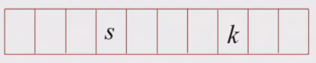
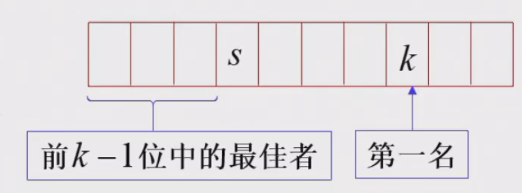
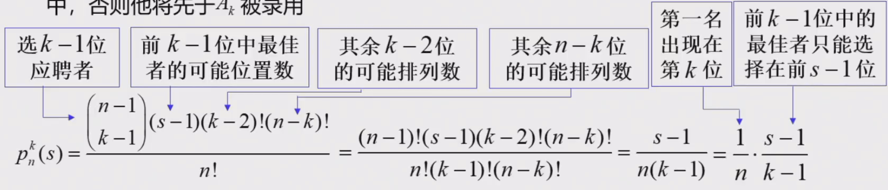
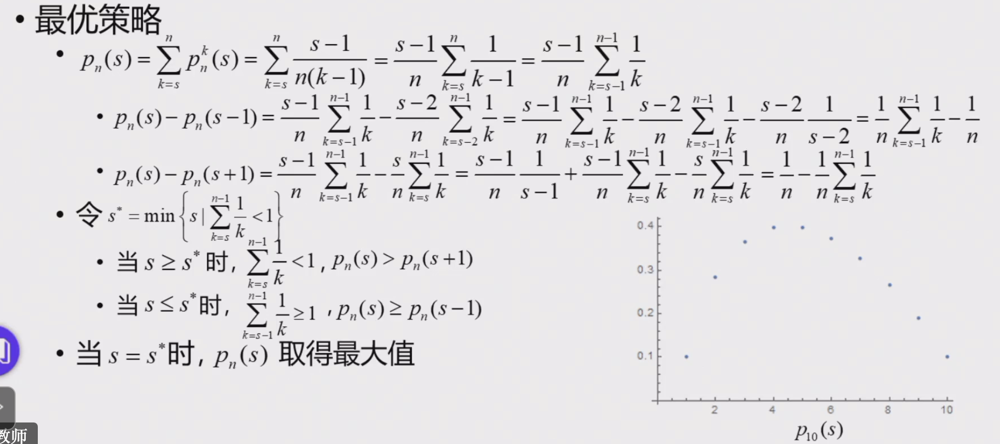

# 招聘问题

    n个求职者应聘.按照顺序依次面试,每个人面试结束后面试官必须立马决定是否录用
    一旦录取一个求职者,面试立马结束
    现求一个最好的策略.使得录取最好的求职者的概率最大

- [毕导科普](https://www.bilibili.com/video/BV1uJ411D7AW/?spm_id_from=333.999.0.0&vd_source=5f080a6043a40b32a88c80bbaba081b5)
- [百度百科](https://baike.baidu.com/item/%E7%A7%98%E4%B9%A6%E9%97%AE%E9%A2%98)

- 数学描述

    - $j$表示在所有应聘者中排名居于第$j$位,(绝对位置)
    - $A_i$表示第$i$个应聘者的绝对名次,$A_i=j$表示第$i$个应聘者$A_i$的绝对排名为$j$
    - $A_i$在前$i$位接受面试的应聘者中的综合能力排名记为$y_i$,称为其相对名次,显然$1\leq y_i \leq\min\{i,A_i\}$
    - 招聘方只能根据每位应聘者的相对名次进行抉择
    - 备选者:满足$y_i=1$的应聘者,备选者不唯一

        - 策略$s$:从第$s$位开始,录用首次出现的一名备选者

- 古典概型

    - $p_n(s):$采用策略$s$录用到第一名的概念
    
        - $p_n(1)=p(A_1=1)=\frac{1}{n}$
    
    - $p_n^k(s):$采用策略$s$录用$A_k$,且$A_k$为第一名的概率
    
        -  

        - 前$k-1$个人,最好的人在前$s-1$ 中,否则会先$A_k$一步被录用
        -  
        - $p_n^k(s)=\frac{C_{n-1}^{k-1}(s-1)(k-2)!(n-k)!}{n!}=\frac{s-1}{n(k-1)}$,(n个人选位置的问题)
        -  

    - 最优策略:使得$p_n(s)=\sum\limits_{k=s}^np_n^k(s)=\frac{s-1}{n}\sum\limits_{k=s-1}^{n-1}\frac{1}{k}$尽可能大

        - $s^*=\min\{s|\sum\limits_{k=s}^{n-1}\frac{1}{k}<1\}$

            -  

        - $s^*$的估计和渐进性质
            
            -
            -

        - $p_n\left(s^*\right)$ 的值与渐近性质
        
            - $p_n\left(s^*\right)=\frac{s^*-1}{n} \sum_{k=s^*-1}^{n-1} \frac{1}{k}$
            - $\ln \frac{n}{s^*-1}=\int_{s^*-1}^n \frac{1}{x} d x \leq \sum_{k=s^*-1}^{n-1} \frac{1}{k} \leq \int_{s^*-\frac{1}{2}}^{n-\frac{1}{2}} \frac{1}{x} d x=\ln \frac{2 n-1}{2 s^*-1}$
            - $\lim\limits_{n \rightarrow \infty} p_n\left(s^*\right)=\frac{1}{e}$
            

