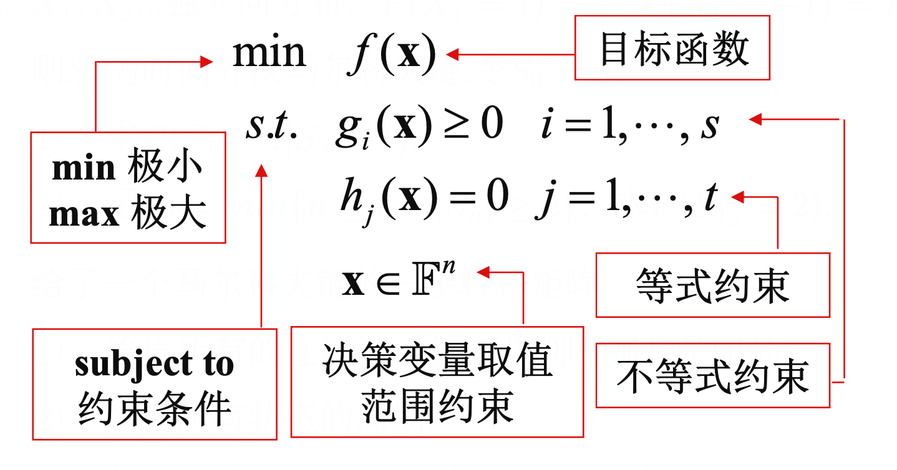

# 数学规划

- 若干变量在满足一些等式或者不等式的限制条件下, 使得目标函数取得最大最小值

    -  

#### 整数规划的松弛

$$\begin{aligned}&\bullet\text{ 整数线性规划 }(\mathrm{IP})\text{ 去除决策变量取整数约束后所得线性}\\&\text{规划 (LP) 称为 (IP) 的松弛(relaxation)}\\&\bullet\quad(\mathrm{IP})\text{ 的可行域包含于 }(\mathrm{LP})\text{ 的可行域中}\\&\bullet\quad(\mathrm{IP})\text{ 的可行解也是 }(\mathrm{LP})\text{ 的可行解,但反之不然}\\&\bullet\quad(\mathrm{IP})\text{ 的最优值不优于 }(\mathrm{IP})\text{ 的最优值}\\&\bullet\quad(\mathrm{IP})\text{ 的最优解与 }(\mathrm{IP})\text{ 的最优解}\\&\bullet\text{ 若 }(\mathrm{IP})\text{ 的最优解为整数解,则它也是 }(\mathrm{IP})\text{ 的最优解}\\&\bullet\quad\text{若 }(\mathrm{IP})\text{ 的最优解不为整数解,不存在高效的取整策略将}\quad(\mathrm{LP})\text{ 的}\\&\text{最优解变为 }(\mathrm{IP})\text{ 的最优解}\end{aligned}$$

$$\begin{aligned}\text{min cx}\\\text{(IP) s.t. Ax}&=\mathbf{b}\\\mathbf{x}\in\mathbb{Z}_+^n\\\text{min cx}\\\text{(LP) s.t. Ax}&=\mathbf{b}\\\mathbf{x}\in\mathbb{R}_+^n\end{aligned}$$
