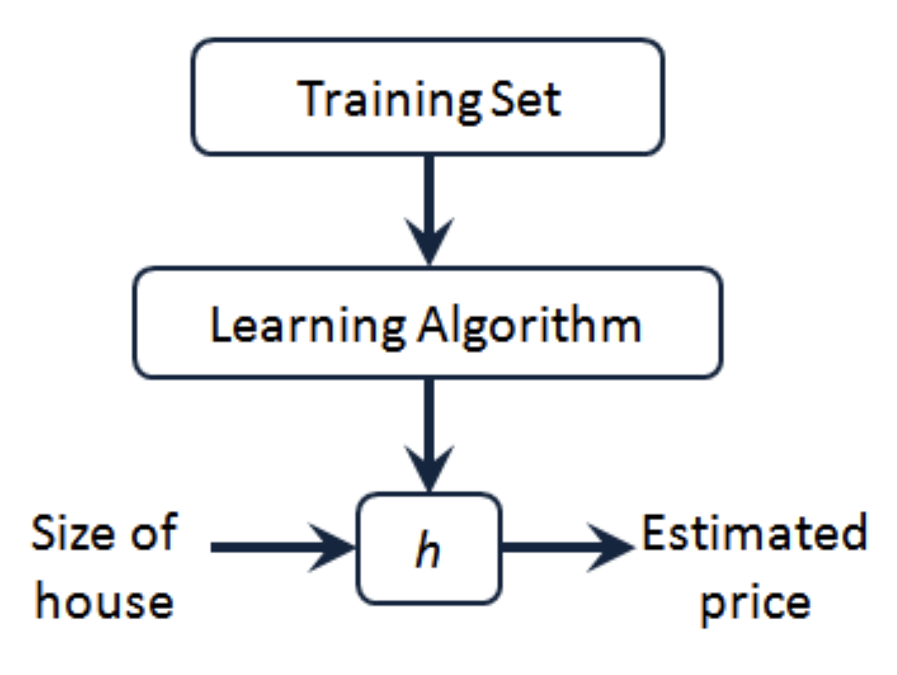

# 单变量线性回归

#### 模型表示
- $m$表示训练集的大小
- $x$表示特征/输入变量
- $y$表示目标变量/输出变量
- $(x,y)$表示训练集的一个实例
- $(x^{(i)},y^{(i)})$表示第$i$个观察实例
- $h$代表算法的解决方案或者说是训练结果
- 
  - 考虑$h(x)=\theta_0+\theta_1x$
  - 只有一个输入变量,因此这是一个单变量线性回归

#### 代价函数
- 建模误差: $h(x^{(i)})-y^{(i)}$
- $J(\theta_0,\theta_1)=\frac{1}{2m}\sum\limits_{i=1}^{m}(h(x^{(i)})-y^{(i)})^2$
  - 代价函数的目标是使得$J(\theta_0,\theta_1)$最小
    - 代价函数也被称作平方误差函数,或者平方代价误差函数
    - 代价函数是一个凸函数,因此只有一个最小值
  
#### 梯度下降
- 梯度下降是一个求函数最小值的办法
  - 当然也可以求最大值,只要令$g=-f$
  - 思想:就是函数沿着梯度的反方向走是下降最快的,在数学分析中我们定义$grad(f)=\nabla f=\frac{\partial f}{\partial x_1}\hat{i}+\frac{\partial f}{\partial x_2}\hat{j}+\frac{\partial f}{\partial x_3}\hat{k}$
  - 可能陷入局部最优
- 批量梯度下降算法(batch gradint descent)
  - $\theta_j:=\theta_j-\alpha\frac{\partial}{\partial\theta_j}J(\theta_0,\theta_1)$,其中$\alpha$是学习率,控制梯度下降的速度.
    - 这里可以用 Euler 折线的思想理解,实际上就是往导数方向走了一步,步长由$\alpha$决定
    - 所有的参数需要同步更新

#### 梯度下降的线性回归
- $\theta_0:=\theta_0-\alpha\frac{1}{m}\sum\limits_{i=1}^{m}(h(x^{(i)})-y^{(i)})$
- $\theta_1:=\theta_1-\alpha\frac{1}{m}\sum\limits_{i=1}^{m}((h(x^{(i)})-y^{(i)})x^{(i)})$