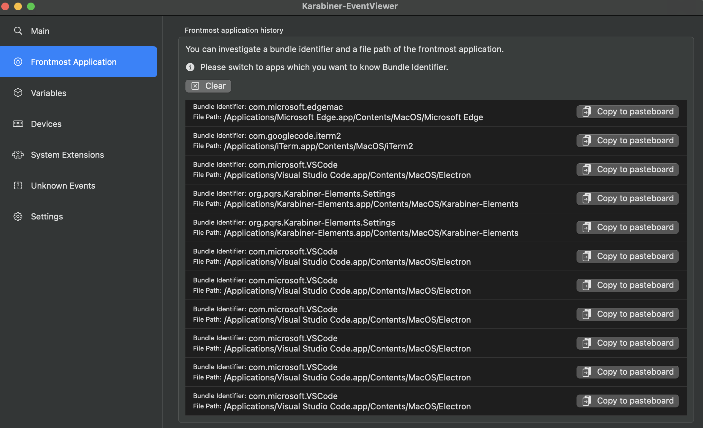
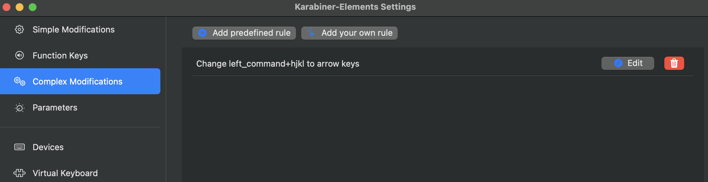

# Karabiner-Elements

[官方网站](https://karabiner-elements.pqrs.org/)

[配置文档](https://karabiner-elements.pqrs.org/docs/manual/configuration/)

[如何对具体的软件做更改](https://karabiner-elements.pqrs.org/docs/json/complex-modifications-manipulator-definition/conditions/frontmost-application/)

## 使用方法
- 使用Karabiner-EventViewer查看按键的key code和modifiers
  - 
- 使用Karabiner-Elements修改按键映射
  - 

## 个人配置
- 使用 left_command+hjkl 在微信,iterm2 中代替方向键

