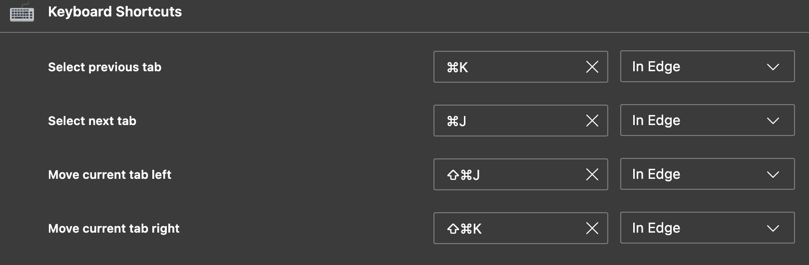

# edge

- [keyboard shortcut](https://chromewebstore.google.com/detail/keyboard-shortcuts/lplcmnhgijkkmflbmhabnccgelffpnog)

    - 使用hjkl移动标签页和切换标签页
        
        - in:edge://extensions/shortcuts
        -  
        -  

        

- [vimium-c](https://github.com/gdh1995/vimium-c)

    - 在[github](github.com)上禁用了"/",避免和github搜索冲突
    
    - [配置](extension://aibcglbfblnogfjhbcmmpobjhnomhcdo/pages/options.html)

        默认p 在当前页面打开,希望打开新页面,不然我现在的页面被覆盖了(大写懒得摁)
        - mapKey p P
        - mapKey P p

    - [pdf-viwer](https://chromewebstore.google.com/detail/pdf-viewer/oemmndcbldboiebfnladdacbdfmadadm)
        
        - 使得 pdf 也可以被 vim 按键控制

    

- [ChatGPT Sidebar](https://microsoftedge.microsoft.com/addons/detail/sider-chatgpt-sidebar-/dhoenijjpgpeimemopealfcbiecgceod?hl=en-US)

    - 代替 bing AI 的工具

