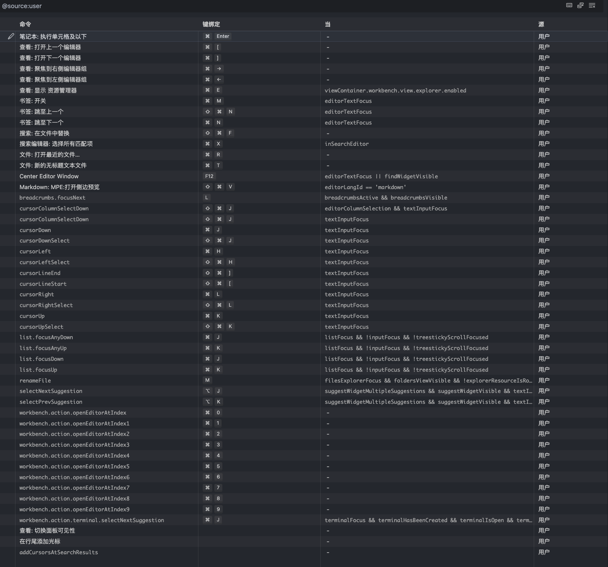

# Vscode

- plugins:
  - One dark pro
  - Bookmarks
    - cmd+m 创建书签
    - cmd+n 跳转下一个书签
    - cmd+N 跳转上一个书签
      - 这里沿用了 nvim 使用 n,N 跳转搜索的快捷键
  - C/C++
  - Center Editor Window
    - <F12> 将当前文件居中
  - Chinese (Simplified) 
  - CodeSnap 可以不用但是不能没有
  - Error Lens
    - 提示错误信息,非常智能
  - Git History
  - GitHub Copilot
  - Image Preview
    - markdown 中图片预览
  - Jupyter
    - 以及一堆 jupyter 自动安装的插件
  - Latex Snippets
  - Markdown All in One
  - Markdown Preview Enhanced
  - Material Icon Theme
  - Path Intellisense
    - 自动补全路径
  - Pylance
  - Python
  - Python Debugger
  - Rainbow CSV
    - 让 csv 文件更好看
  - Remote - SSH
    - 远程连接,还能连接 WSL
  - vscode-pdf
    - 预览 pdf 文件
  
- 

[my config file](https://vscode.dev/editor/profile/github/d1f873e1e6f17bd5ebd57c8896f54995)

